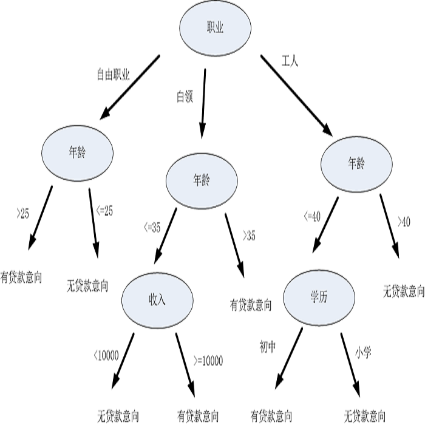
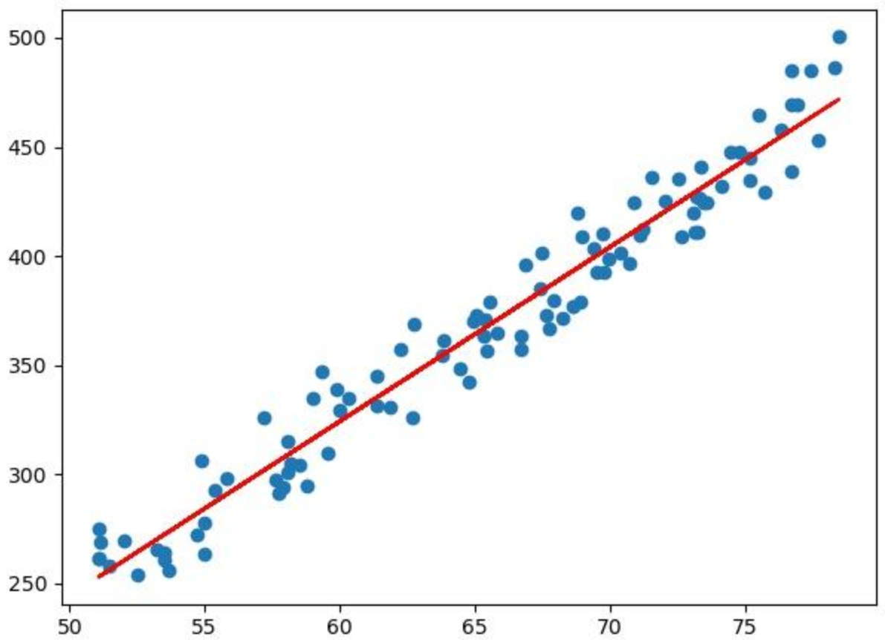
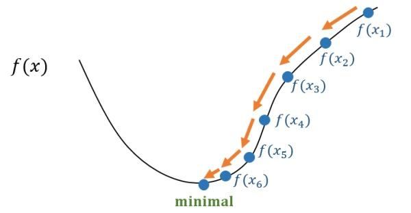
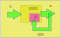
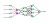
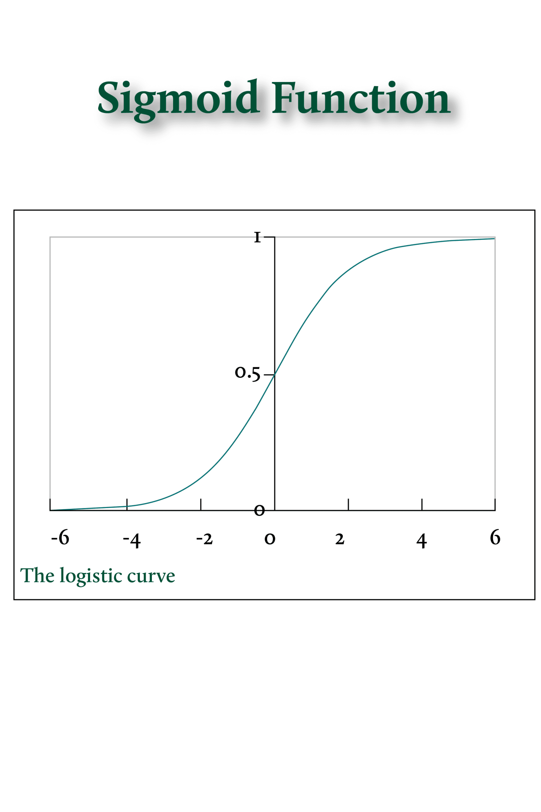
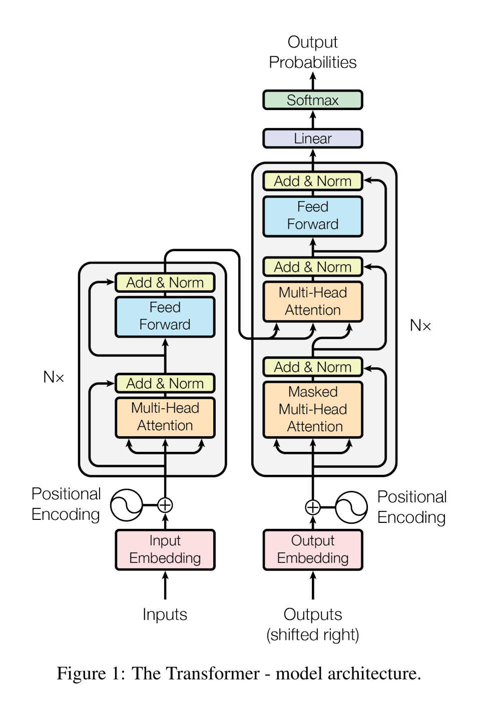

.. Kenneth Lee 版权所有 2025

:Authors: Kenneth Lee
:Version: 3.0

V3的说明
********

介绍
====

如果读者看到这一段文字，说明您看的是本文3.0以上的版本。

我决定要升级这个版本的主要原因是这几年大语言模型（LLM）有了很大的发展，为我们
解释《道德经》提供了更多的概念工具，让我们可以更容易沟通《道德经》里面描述的概
念，所以我希望引入这些概念工具来帮助读者更好理解《道德经》想要表达的东西。

我不希望上面这个表述让不是LLM领域的读者感到焦虑，觉得这个版本会让你看不懂。实
际上我没有打算改变本书的整体描述内容。你可以认为这个版本我只是增加了给不是做
LLM的读者一些科普，让你可以更好理解大语言模型是怎么工作的。在你理解这些细节后，
你就会形成新的概念，我们就可以用这些概念更好地认识《道德经》所表达的内容了。

这个道理就好像你没有见过狗，也没有见过猫。我给你形容狗，半天你也不明白。但如果
你见过猫，我用猫去类比狗，你就会容易很多。这里的“猫”，就是我们在沟通“狗”的时候
用的“概念工具”。

所以，我们也不是像某些喜欢附会的人那样，说什么“老子在两千多年前就已经参透LLM了”。
这样看问题说明他们连“名”的基本认识都没有，就更谈不上什么“理解《道德经》”了。
LLM的概念可以用于理解《道德经》，是因为它们研究的是同一个领域：语言的特征。但
老子研究语言的特征是为了解决高层判断问题，而LLM研究语言的特征是为了解决知识的
抽象问题。

那么我们现在就来说说LLM的“训练”。我们很多人对LLM的具象认识就是使用ChatGPT，
DeepSeek这些工具的认知：聊天机器人。这个东西很像一个人，你问它问题，它回答你问
题。

过去计算机模拟的聊天机器人大部分都是基于“逻辑思维”的。什么意思呢？就是你输入一
句话，计算机必须通过一组逻辑判断，根据这些逻辑判断固定返回什么回答。

这种判断模型经常是这样的：

很明显这种“智能”非常死板，它更像人的“记录”，而不是人的“智能”。人的语言非常复杂，
有大量的情绪，隐喻和随意性在其中，这种生硬的模型是模拟不了的。

但现在的LLM可以做到这种程度（下面是我用ollama运行一个DeepSeek-R1:32b蒸馏模型得
到的结果，>>>开头的行是我的提问，后面是LLM的回答）：::

  ~ % ollama run deepseek-r1:32b
  >>> 《道德经》是讲什么的？
  <think>
  嗯，我现在要回答关于《道德经》的问题。首先，《道德经》是谁写的呢？我记得好像
  是老子写的，对吧？他是道家学派的创始人。这本书的名字是不是也有其他说法？比如
  有时候叫《道德真经》或者《五千言》，因为它的字数大概在5000字左右。
  
  然后是内容方面，我听说《道德经》分为上下两部分，上篇讲“道”，下篇讲“德”。那
  “道”具体指的是什么呢？好像是指一种宇宙的根本原理，是无形无名的东西。我记得里
  面提到过“道可道，非常道”，这句话的意思是不是说能用语言表达的道就不是永恒的道
  呢？
  
  再说“德”，下篇可能更多的是讨论人应该如何遵循“道”的原则来生活和治理国家。这里
  涉及到的内容可能包括自然法则、无为而治等思想。无为而治听起来像是不强制干预，
  让事物自然发展。
  
  我还记得里面有一些著名的句子，比如“上善若水”、“无欲则刚”，这些都说明了老子提
  倡的处世之道。是不是还有关于柔弱胜刚强的思想？这部分可能强调以柔克刚，避免直
  接对抗，转而用柔和的方式解决问题。
  
  另外，《道德经》不仅是一部哲学著作，也被视为智慧之书和人生指南。它教导人们如
  何生活得更自然、更和谐，同时对政治和社会管理也有深刻的见解。比如“治大国若烹
  小鲜”这句话，是不是意味着治理国家应该像煮小鱼一样，火候要掌握好，不能太急躁？
  
  我还想，现代人读《道德经》有什么意义呢？可能在于它提供了一种不同的思维方式和
  生活态度，尤其是在现代社会快节奏、高压力的情况下，学习如何保持内心的平静和自
  然。此外，它对个人修养和社会和谐都有指导作用。
  
  不过，我是不是遗漏了一些内容？比如，《道德经》中还有关于战争的观点吗？好像有
  提到“兵者不祥之器”，主张尽量避免战争，推崇和平解决争端的方法。
  
  总的来说，《道德经》是一本涵盖哲学、伦理学和政治学的综合性著作，强调顺应自然、
  无为而治以及个人修养的重要性。它对后世影响深远，在中国乃至世界文化中都占有重
  要地位。
  </think>
  
  《道德经》，由老子所著，是道家学派的经典之作，全书约五千言，又名《道德真经》。
  该书分为上下两篇，上篇探讨“道”，下篇阐述“德”。老子的“道”被视为宇宙的根本原理，
  超越语言和形态，如其开篇所述：“道可道，非常道。” 下篇则强调人应遵循“道”的原
  则生活与治理。
  
  《道德经》蕴含丰富的人生智慧，提倡无为而治、上善若水及以柔克刚等理念。它教导
  人们追求内心的平和与自然的生活态度，同时对政治和社会管理提供深刻见解，如“治
  大国若烹小鲜”，强调治理的细腻与节制。
  
  在现代社会，《道德经》的价值体现在其独特的思维方式和个人修养指导上，帮助人们
  应对快节奏生活中的压力，倡导和平解决争端，避免暴力。总之，《道德经》不仅是一
  部哲学著作，更是涵盖伦理学和政治学的智慧之书，在中国文化乃至世界文化中具有深
  远影响。

  >>> 有什么证据证明它分了“道”，“德”两篇？它原文这样说了吗？
  <think>
  嗯，用户现在在问《道德经》为什么分为“道”和“德”两篇，有没有原文这样说的。首先，
  我得回忆一下《道德经》的结构，确实通常认为上篇是讲“道”，下篇是讲“德”。那是不
  是在原文里有提到呢？我记得第一句话就是“道可道，非常道；名可名，非常名。” 这
  应该是在说“道”的部分。
  
  然后，第二章开头是“天下皆知美之为美，斯恶已；皆知善之为善，斯不善已。” 这一
  部分似乎还是在讨论价值判断，可能属于上篇的内容。接着到了第三十八章，“上德不
  德，是以有德；下德不失德，是以无德。” 这里明显是在讲“德”，所以可能从这一章开
  始转向下篇。
  
  另外，第八十一章是全书的结尾，提到了“信言不美，美言不信；善者不辩，辩者不善；
  知者不博，博者不知。” 这部分总结性的内容，似乎是在收尾，结束关于“德”的讨论。
  
  所以，虽然原文并没有明确标出上下篇，但通过内容的变化和主题的转换，可以看出分
  为“道”和“德”两大部分。上篇主要探讨“道”的哲学概念，下篇则转向如何实践“德”。这
  种分法方便后人理解和研究，尽管是传统上的划分，但也符合文本本身的逻辑结构。
  </think>
  
  《道德经》虽然没有在原文中明确提到它分为“道”和“德”两篇，但这一分法是后世学者
  根据内容的逻辑和主题演变而来的。以下是支持这种分法的主要依据：
  
  ---
  
  ### 1. **内容的主题变化**
     - **上篇（前37章）**：主要围绕“道”的哲学概念展开。
       - 第1章开篇即讲“道”：“道可道，非常道；名可名，非常名。”
       - 后续章节探讨了“道”的性质、作用以及与自然和人类的关系（如“无为而无不为”
         “上善若水”等）。
     - **下篇（后44章）**：主要围绕“德”的实践展开。
       - 第38章开始转向对“德”的讨论：“上德不德，是以有德；下德不失德，是以无德。”
       - 后续章节更多涉及个人修养、治国之道以及社会伦理。
  
  ---
  
  ### 2. **语言风格的变化**
     - 上篇的语言更为抽象和哲学化，多用比喻和象征来描述“道”的本质。
     - 下篇则更加具体，讨论如何将“道”的理念应用于日常生活和社会治理。
  ……
  
  虽然《道德经》原文并没有明确提到上下两篇的分法，但这种划分是基于内容逻辑、语
  言风格以及后世学者的传统解读而形成的。它有助于更好地理解和研究这部经典著作。

虽然我认为它的回答并不靠谱，但你不能不说，它确实更像一个“人”了。它甚至还有一个
思维的过程，先考虑你的意图，然后才正式回答你（这是一种称为“思维链”的技术，不是
每个LLM都会用到，我们后面会更详细一点去讨论它。）

这样的对话能力过去对计算机是个巨大的挑战，因为传统的计算机基本上是用来做逻辑或
者说“数值”运算的。你让它计算3+3等于几，或者如果3+3大于5就输出6，否则输出1，这
些东西传递给计算机都很容易做到，但你要让它谈谈对3+3的感想，它就没法弄了。也许
你可以内置一个回答给它，让它固定回答这个，但你再问一句，这个东西它不能内置，它
就会回答得牛头不对马嘴。

这里的关键在于，你人没法教它应该怎么做。维特根斯坦在他的《逻辑哲学论》（我看的
英文版本叫Tractatus Logico-Philosophicsu》中用了6章来描述他的逻辑概念定义和表
示法，而最后一章，只有一句话：::

  What we cannot speak about we mush pass over in silence.

我看的版本的英文翻译者（D. F. Pears和B. F. McGuinness）在前言中把这句话补全
了：::

  what can be said at all can be said clearly, and what we cannot talk about
  we must pass over in silence.

也就是说，通过逻辑，能说清楚的我们都能说清楚，我们不能说清楚的，只能在沉默中传
递。

请注意，这是逻辑，不是“沉默是金”这种心灵鸡汤。

“苹果是红的，这个水果不红，所以这个不是苹果。”这句话可以说清楚，这是逻辑的。
但“什么是苹果，什么算水果。”这没有说清楚，我们的“清楚”，是在逻辑空间中清楚的，
但某个物体我们认为是苹果，这个东西是“你知我知”，这个东西是在沉默中传递的，它不
是我们逻辑空间中的一部分。

你当然可以进一步解释什么是苹果，什么是水果。但你永远需要其他概念去解释它，这些
概念具体是什么，就必须在沉默中传递。

传统计算机擅长解决的是逻辑空间中的问题，逻辑永远都可以出来一个结论，最多只是计
算快慢的问题，但它不能解决“在沉默中传递”的问题。这是因为，我们人就只能把自己思
想的“逻辑”部分传递给他，我们没有能力传递我们自己都说不清楚的那些“你知我知”的东
西给它。就算它产生一些随机的信息出来给你，你也不觉得它有“智能”，因为你和它不能
“你知我知”，没法共情。

理解这一点，我们就容易明白《道德经》说“道”不可“道”的含义了。“道”包含无数细节，
我们感知到它的是它影响的我们对这个世界的认识（“名”），我们谈的也是我们这个“名”，
但这个“名”并非“道”本身。所以《道德经》说的“天地”，并不是真实的，它是我们对“道”
的认识，是“名”。《逻辑哲学论》说的“World（世界）”也一样，它是我们对Thing（“东
西”）的认知，不是Thing本身。

“道”可以用名去“道”，但“名”只是“道”的一个我们自身的一个“关注点”（妙），不是“道”
的本体，也不是它的全部信息。名是道和我们本身的感官共同作用的结果，它包含了我们
自己的成份在里面。所以名里面包含了“众甫”的本身的信息，我们看名不但看到了“道”的
部分特征，我们也看到了“众甫”的部分特征。商人描述的黄金和矿工描述的黄金包含着不
同的信息。

我们这里介绍LLM，就是用一个更加直观的方法，让大家感受到这个在沉默中传递的东西
具体是什么样的。看看我们觉得没法“数字化传递”的那些恍恍惚惚的“你知我知”的概念，
是怎么通过明确的数字传递过去的，让冷冰冰的机器，也能和你“共情”的。

大语言模型的数学原理
====================

线性回归
--------

我们用线性回归来理解大语言模型的原理。如果你不记得线性回归具体怎么做的，不要紧，
你大致知道它是什么东西就行了，相关的知识我们后面会一点点给你提回来。但如果你说
你完全不知道“线性回归”是什么，那这个V3的升级的内容不适合你。不过，这不影响你继
续看这个道德经直译，少数地方提到LLM有关的比喻，你略过就是了。我尽量让这些东西
都集中在这一章之内。没有数学基础可以把这整章都忽略掉。

最简单的线性回归方法是尝试得到这条方程的两个参数：
:math:`y = ax + b`\。

假定你有两个指标x和y，比如放水的分钟数和水缸的高度，或者说开车的时间和开车的距
离之类的，你进行很多次的测量，知道很多个(x, y)的值，现在你想知道a和b，以便以后
你知道x就可以预测到y，这个通过很多的(x, y)的经验数据得到a和b的方法，就叫“线性
回归”。

当然，如果是纯数学，凭初中的数学知识，我们知道只要两对(x, y)，我们就可以得到两
条二元一次方程，就足够解出a和b的值了。但工程上，我们每个测量结果都是有误差的，
所以实际上我们是有很多的(x, y)，然后我们尝试获得“最好”的a和b，让所有的(x, y）
的综合误差是最小的。这个算法就比解方程复杂一点了。

一般我们会先给出一个误差函数（称为loss，比如均方差就是一种常用的loss函数），我
们把所有的(x, y)（注意，我们这样说的时候，(x, y)是向量，包括所有的点）输到loss
中，我们求a和b等于多少的时候，loss能达到最小值。

这有很多数学方法，但现在用得最多的是“梯度下降法”，基本原理是先给a，b设定一个随
机的值，然后在(a, b)的位置上，对loss函数求偏导（注意，对于loss函数，（a，b)是
变量，而(x, y)是常数了），然后把a, b各自向着偏导的方向移动一个小Delta（称为
Learning Rate），如此反复多次，loss就可能向着最小值慢慢下降了。

这个具体要多少次常常是试出来的，调整Delta不断比较loss是不是可以接受，通常慢慢
就能找到越来越好的a，b的值了。这里有很多细节的工程问题，比如这个Learning Rate
设置多大才能平衡效率和过度调节的问题。但原理就是这么个原理了。

线性回归是最简单的机器学习方法了，我们可以通过它来对比人脑的学习过程：我们把(x,
y)称为“训练集”，这是我们的学习经验，它相当于我们认识世界的时候不断看到的世界的
规律。而(a, b)就相当于我们的大脑，我们在小孩的时候，a, b可能是些随机的值，但我
们看见了，听到了，摸着了，得到了很多的经验，这些经验改变了我们的a和b，我们就记
住了一些东西了，这个a和b，我们称为“参数”，“模型”，或者“模型参数”。然后我们再遇
到一个新的x，我们就能进行“预判”，对y是多少就有了一个预期了。如果我们把这个过程
看作一个黑盒方程，学习就是一个这样的东西：

我们感受到外界的信息，根据这个信息和的内部参数综合做出决策，然后这个决策会给我
们反馈，这个反馈和输入共同构成(x, y)，改变我们的内部参数，然后影响我们的下一个
决策，我们就在这个过程中，反复改进我们脑子中的模型参数，这些参数，和输入输出不
是直接相关的，但输入输出又和它们有千丝万缕的关系。

神经网络
========

简单的线性回归只有两个参数，通用的线性回归算法x是个向量，线性方程变成：

.. math::

  y = a_1x_1 + a_2x_2 + ... + a_nx_n + b

这可以容纳更多的参数，也数量也非常有限，这几个参数形容不了世界的复杂性。世界的
规律不是线性的，甚至不是多项式可以表达的。

数学家发现了一种可以容纳更多参数的，可以适配各种各样的“规律”，这就是“神经网络”，
神经网络这个名字听着很高大上，其实作为方程，它是很简单的，如果用大白话来形容，
你可以把它称为“权重加成”。

在我们介绍这个方程前，让我们再回顾一下线性回归的原理：你学习的可能是“放水时间”
和“水池高度”这两者的规律，但你学习以后，你记住的是“斜率”和“截距”这两个概念，这
两者（前后两个概念）在我们的概念中，几乎没有什么直接的关联。但它们居然是“规律”。
这是不是很有趣？

我们脑子记住的东西，和我们学习经验的那个东西，并不直接关联！或者说：没有直接的
因果关系！

大部分时候，我们考虑问题，其实就是把很多的规律（参数），这个多少份，那个多少份，
糅合到我们的参数中。比如说，一个游戏角色好不好，我们拿他30%的武力值，40%的智力
值，25%的敏捷和5%的防御，权重一加，我们就去对比和其他角色的高低了。这个[武力，
智力，敏捷，防御]的向量，乘以[0.3, 0.4, 0.25, 0.05]的向量（这种乘法称为“卷
积”），就是一个权重加成，可以得到这个角色另一个角度的考评，这种考评结果也是一
种向量比如[招聘费用，战场生存力]。神经网络就是一个这样的计算过程：

你看，说得神秘兮兮的，这个神经网络的算法其实非常简单，就是把每个输入都做一个权
重加成，然后全部加起来，得到另一个维度的不同参数而已。它被称为神经网络，因为它
的样子很像人的神经组成结构：这个方程的输入就是一个个神经元的触觉，触觉感知到前
面的刺激，就把这种刺激传递给下一个神经元，这个连接前后神经元的组织是可以被“训
练”的，所以这里这些[40%, 30%, 25%, 5%]遇到反馈后，就会发生改变，产生“学习”。下
一级把这些刺激收集起来，可以传递给下一级。这样会产生一个多级的传递和学习结构：

这种结构伸缩性很强，你可以在每层上任意增加更多的神经元，它的内部权重的参数就增
加了，你也可以增加更多的层，这样整体也会产生更多的参数。

有一个这样的算法，我们就得到一条比线性回归（包括任意曲线回归）更大，更自由的方
程。这个方程，就称为“神经网络”。很多刚接触神经网络的人都把这个东西理解成现实世
界互联网网络那种“传递信息”的东西（比如光纤，wifi等）。实际上这两者不是一个意义
上的网络。“神经网络”形容是是这条方程的组成形式，它本质是一个方程，不是一种传递
信息的介质。

当然，前面我们只是介绍原理，在实践中，我们其实除了权重还会加上线性回归一样的
“截距”偏置，以便在某个权重上产生本身的“权重”（和任何输入无关）。我们还会通过把
结果叠加一个“激活函数”去对结果进行过滤。这个目的其实主要是“非线性化”。前面我们
说过了，线性回归做梯度下降的前提是方程可导，但权重计算基本上形成的是一条折线，
这会让结果常常是不可导的，所以，加一个要素进去，让这个结果不要对输入反应得那么
“生硬”，这些激活函数通常不会对输出造成很大的改变，就是简单让它“柔和”一点而已，
比如下面这个Sidmoid函数就是一种常用的激活函数：

所以，作为忽略工程实现的原理理解，我们基本上理解权重的部分就够了。

神经网络常常被比喻成人脑的神经网络，其实不利于有数学思维的人理解的。让我给你换
成线性代数的概念你就好理解了。

前面我们用游戏角色的例子展示了神经网络是怎么把武力-智力-敏捷-防御这个四维向量
转换为一个招聘费用-战场生存力的二维向量的。线性代数没有忘光的读者应该很敏感地
发现了，这其实是一个“线性变换”。线性变化就是坐标系只做加权或者旋转变化的变化：

线性变换能维持原始坐标系的很多特征，比如平行线会保持平行，所有面积都保持等比例
缩放，等等。维持，原坐标系的任何一个坐标，都可以用相同的变换算法转换为新坐标系
的点。而这个算法就是前面说到的“权重加成”。最后就可以表达为一个矩阵乘法。

比如你有一个4维的变量[x1, x2, x3, x4]，乘上一个4x2的变换矩阵，你就可以得到一个
2维的变量[y1, y2]，计算方法就是：

.. math::

  y_1 &= k_{11}x_1 + k_{12}x_2 + k_{13}x_3 + k_{14}x_4 \\
  y_2 &= k_{21}x_1 + k_{22}x_2 + k_{23}x_3 + k_{24}x_4

对应的变换矩阵就是：

.. math::

        \left[ {
        \begin{matrix}
                k_{11} & k_{12} & k_{13} & k_{14} \\
                k_{21} & k_{22} & k_{23} & k_{24} \\
        \end{matrix}
        } \right]

所以，从理解算法的角度我们根本不需要想那么复杂的神经网络结构。其实每个神经网络
(层）计算，就是一个变维的过程：我们输入一个向量，乘以变换矩阵，得到变维后的向
量。也就是同一个问题，在另一个维度上的认知。

顺便说一句，如果我们把前一个坐标系的t个坐标合并起来组成一个矩阵，把这个矩阵乘
以变换矩阵，我们会得到一个t个坐标组成的后一个坐标系的矩阵。换句话说，变换矩阵
不但可以作用在一个点上，也可以作用在一组点上，把每个点都做一样的线性变换。我们
很容易把前一个坐标的一个图形，变化为新坐标系的新图形。记住这个小特征，它对我们
后面理解Transformer模型会有帮助。

这给了我们一个新的方法来理解我们道德经的“恍惚”的概念。比如你看到一只猫，我们把
你的眼睛看作是一个传感器，它捕获了1000个点的颜色，这个包含1000个数据的向量，就
是你的恍惚，你都看见了，但你的神经网络对它进行了变维，变成了2000维的空间的坐标。
现在你告诉我，这个2000维的数据表示什么？要说出来的话，我也只能说这是“猫”的信息，
但其实你非要说它是什么，看起来它就是一个2000维的一个向量。什么时候它是“猫”呢？
只能是这个2000维的数据穿过整个神经网络，经过一次次的变维，最终变成“猫”这个
Token（Token的概念我们后面介绍Transformer的时候回过头来讨论）的时候了，这时，
它就是一个“名”。

当我们细细地打开我们大脑的思考过程来看这个问题，我们就能更清楚看明白“名”和“道”
的差距有多大了。从恍惚开始，你就已经离开“道”了。你的信息被反复变维，从各个角度
来寻找潜在的规律，最终形成了你的一组Token（名），这就是你的认识。

现在我们可以抽象性地理解神经网络了，它是一条包含大量参数的方程，这些参数用作输
入的变换矩阵，让我们从不同的维度去变换我们原来的认识，并且在这种认识的高层抽象
上进行再次认识，从不同的层次上发现规律。

神经网络每层的变换矩阵（又叫“权重矩阵”）就是它的“大脑记忆”。外部的刺激被权重矩
阵所“判断”，形成了我们的认识，“认识”的规律反过来修正了我们的权重矩阵，改变我们
未来的“认识”。我们被外界的刺激中包含的规律和权重参数改变我们的认识，又认识反过
来改变我们的权重参数。所以，学（接受刺激）而不思则罔，思而不学则殆。

神经网络中，把方程输入输出的两层称为“显层”，把中间的其他层称为“隐层”。有了这个
概念，我们就很容易理解《道德经》中说的：名和恍惚两个概念是什么了。名是我们明确
形成的概念，是我们在输出层上看到的数据，而恍惚是隐层的权重，这个信息存在在我们
的脑子中，但我们不知道它是什么，我们说不出来，因为说出来的就是我们输出的Token，
但我们还有大量从不同维度理解这些信息的“隐层权重”，这些东西你说它“没有”呢，这不
对，因为我们还是能感知到它，但你说它有呢，你确实也说不出来。

我觉得，老子能在那个对这些基础研究都没有的情况下，直接感知到“恍惚”这个概念的存
在，感知能力实在是非常强了。当然，我个人更认为这不是老子一个人发现的，这应该是
我们的祖先进行大量的概念归纳后的共同智慧，否则它不可能这么指向明确地保留到今天。

Transformer
===========

综述
----

Transformer是一种面向大语言模型的神经网络，现在几乎所有的大语言模型都是基于这
个结构的模型来实现对话的。像我们很熟悉的OpenAI，DeepSeek，千问这样的模型，都是
基于这个神经网络的结构的。当然，都有不同的改变，但这不影响我们通过这个基本的模
型去理解大语言模型是怎么对输入的文字进行变维，最终变成一种“智能”的。

Transformer这个概念来自一篇Google公司的论文，叫《Attension Is All You Need》，
翻译成中文就是“你需要的只有注意力”。这是直译，你不要当作一般人的语义来理解，不
要觉得这是让你集中精神。这句话的意思是：我们做了各种大语言模型的实践以后，发现
整个算法核心其实就只有“注意力”（这个算法）。

其中Transformer这个单词直译是“转换器”，它也是著名的漫画和电影《变形金刚》的名
字，表示那些可以“变身”成汽车的机器人。我花时间把这两个语义介绍给读者，其实也是
想强调一下：两种不同的语言，几乎是没法用一一对应的方式来翻译的。古人说的牛马，
和现代人说的牛马，就不一样。大语言模型的“转换器”，和可以“变身”的机器人也不是一
个东西。中文的机器人和英文的Android或者Robot也不是一个意思。注意到这个特征，也
许有利于你理解Transformer的工作原理。

我们这里不翻译，把这个算法叫Transformer，主要就是想用它被创建时的原始语义。你
可以想象如果我们把这个东西叫“转换器”，你很难不把它和泛泛的转换器的概念联系起来。

很多人批评英文在每个领域都创建了很多新词，不利于交流，其实这是把某个领域研究精
细以后的必然选择，因为你就是要在这个领域创建独一无二的概念，好和其他概念区分。
所以我们做计算机的，也愿意在中文中插英文概念，因为这样我们就可以和我们日常用的
那个概念区分开了。这个问题不是中文本身的问题，英文一样存在，如果你经常看论文或
者看数学证明，里面大部分变量都用罗马字符或者拉丁字母表示。这也是为了换一种语言
来表达一个“独一无二”的概念。

Transformer的算法主要是论文中下面这张图描述的：

没有神经网络的基础，可能你不知道这个图是什么意思，有神经网络基础，我们还是很好
看懂它的原理的。

首先，这个图中的每个框，就是一个神经网络的层，里面带着自己的权重，可以训练，你
输入的问题，变成一个矩阵，把这个矩阵输入到神经网络中，进行一次次的变维操作，根
据变换矩阵（后面我们统一叫权重矩阵，前面的名字强调它对输入的改变作用，而权重矩
阵强调的是它类似人脑的“记忆”功能），变成一个内部的“认知”（恍惚），这种恍惚的信
息一层层传递，最后变成一个感知的输出，形成“概念”，变成说出来的对话，这就是
Transformer的效果。

和人不一样，Transformer的认知过程和训练过程是互相独立的，你和Transformer对话，
它和一层层的权重矩阵进行计算，最后输出对话，这个过程中权重矩阵是不改变的。

而训练是一个独立的过程，你给它输入大量的文档，小说，文档，程序，对话，论坛的帖
子等等，Transformer用前面说的话和后面的话进行“规律匹配”，通过梯度下降算法训练
权重，让权重和这个规律实现“最小loss”，这个原理和线性回归是一样的。但人肯定是不
用成本这么高的算法来训练自己的脑神经，具体它是什么方法，我也不知道。反正肯定不
是这个方法（当然，人脑也记不住现在大语言模型现在记住的那么多信息）。但无论如何
吧，Transformer在使用的过程中，它的脑子就不再“成长”了，这一点和我们人是不一样
的。虽然你也确实可以把你后来和它的对话也放到它的训练数据中，但这两个过程是互相
独立的。

我强调这个，主要是想告诉你，现在的神经网络，还和人是不一样的，你不能完全把两者
对等，但研究神经网网络，确实有助于我们类比我们很难用语言来表达的人脑的机制。

我们接着说这个结构的总体原理：这个图分成左右两个部分，你可以看到它有两个输入一
个输出。为什么会有两个输入呢？我们看看它的用法你就知道了。我们设想一个对话：::

  你：你好
  AI：你好，有什么可以帮你？

这个对话中，输入就是“你好”，输出是什么呢？——嗯，不是后面那句话，而是“你”。整个
神经网络，只计算一个单词（称为Token），这个计算完成后，再次在右边的输入上输入
“你”，得到“好”，然后把“你好”输入到右边的输入上，如此类推，得到：::

  ，
  有
  什么
  可以
  帮
  你
  ？
  <EOD>

最后一个Token表示对话暂时结束。所以，你会发现，这整个计算过程，其实一直都是用
前文推断后文。所以，整个AI对话，其实就是一个“补字游戏”，你不一定用它来对话，你
完全可以写一些文字作为开头，然后让AI补全后面的文字而已。

所以，几乎所有的LLM模型都可以用来做文字补全，比如你给它“白日依山进”，可能它会
给你补成“黄河入海流”。由于你用这句文字“训练过”它，它的权重里面“记住”了这个“规
律”，所以它就能大概率这样回答你。

置于它为什么能被训练出“对话”的规律，那是因为训练数据是这样的：::

  <User>你好</User><AI>你好，有什么可以帮你？</AI>

所以，它也学会了对话类型的连串语句的特征。所以，后面我们不用关心“对话”了，我们
只关心“补全”。

Tranformer这个“方程”，就是用一组神经网络层，充分暴露语言的特征，从而用权重记住
这些特征，整个Tranformer网络设计的重心，就是怎么把语言的规律充分暴露出来，让它
在信息传递中尽量贴近人的思维特征，保留人思维会保留的特征，放弃人思维不保留的特
征，从而让它“像个人”。

基础结构
--------

Tranformer模型分成两个左右两个部分，看起来非常接近，这个结构的基础来自过去的翻
译软件。比如中译英。用过这种软件的读者应该知道，要做好整个句子乃至整个文章的翻
译，你是不能一个单词，一个单词去直译的。因为两种不同的语言没法一个单词对一个单
词去翻译的，否则就会造成这种结果：::

  What's your name?
  什么是你的名字？

这个显然很生硬，因为中文问人家名字是这样问的：“你的名字叫什么？”，这还算好了，
复杂一点的遇到更多一些多义词，不联系上下文你根本不知道那个词应该译作什么。

所以，翻译软件会先把输入先翻译成一种“内部表达”（权重），然后再把这些内部表达，
重新表达成另一种语言。这两个过程，就叫Encoding和Decoding，前者把一种语言转换成
内部表达，后者把内部表达转换成另一种语言。

（这里插一句：这个“内部表达”其实也可以认为是一种“恍惚”。）

这两者几乎是完全一样的，只是训练了不同的权重而已。Transformer继承了这个结构，
所以它就有左右两个几乎一样的部分。你可以认为它就是一个翻译软件，把“问题”翻译
成“回答”而已。

对于这个结构，我更想提醒读者的是：神经网络的设计，和一般设计普通的计算机算法很
不一样。我们前面就说过，一般计算机算法基本上是严格的，设计多少层，每层应该是什
么，这是有明确的“因果”关系来支撑决策的。但神经网络多一层少一层，有时根本不影响
什么。因为训练过程会让这一层也向“实际的规律”靠近，这也没有精确的逻辑关系可以说。
神经网络的算法设计，更重视的是如何“充分暴露重要的规律，隐藏多余的，没有意义的
规律”。理解这一点，我们才能理解我们后面讨论的重点。

Token vs. Embedding
-------------------

Transformer的输入是Token，就是“包含某种意思的词语”，让我区分一下：

当我们说“道德”的时候，和我们说“道”的时候，我们期望表达的含义是不同的。所以，就
“意思”来说，“道德”和“道”，是两个Token。我们脑子里面思考“道德”的时候，是作为一
个整体来思考它的，但我们有时又确实是把两者“关联”起来了。比如有些人想要拽文，说
不定就会说出“道德，道德，必然要出乎道才能合于德”。如果道德和道是两个东西，我们
不会说出这样的话。这说明在我们的脑子里，这两个Token是有关联的。但如果我们简单
用一个数字来分别代表不同的Token，那么我们就会失去这种关联，而会创建另一种关联。

比如说，我们把所有的Token组织成一个列表，按顺序编码它，道排在11位，刀排在12位，
而道德排在1234位。这个数据输入到神经网络中，神经网络就不会认为道和道德有关联，
而会认为道和刀有关联，因为它们靠得很近。但我们人并不这样认为，所以，为了让神经
网络更像人的思考模型，我们必须让网络忽略道和刀的相关性，而注意到“道”和“道德”的
相关性。

所以，Transformer不用Token的字典下标来表示Token，它用整个字典所有Token的权重来
表示单个Token。

这句话不好理解，看个例子就容易明白了。比如说我们的语言很简单，只有10个
Token：::

  你 我 道 德 刀 道德 我们 飞机 月亮 的
  0  1  2  3  4  5    6     7   8    9

为了表示“你”这个Token，我们先简单写成一个这样的向量：::

  [1, 0.1, 0, 0, 0, 0, 0.2, 0, 0, 0]

你可以看出来，这就是一个所有Token的权重矩阵。“你”这个Token，和字典中的“你”最接近，
所以它在“你”对应的字典位置，权重就是最高的（例子中的1），它和“我”这个Token还有
点关系，所以“我”的权重是0.1，而它和“道”没啥关系，所以权重就是0，……如此类推。

你看，用这种方法表示Token以后，每个Token就只和其他Token有权重关系了，和字典顺
序就没有关系了。这些权重经过一些实际文字的训练，每个Token就会有一组特定的权重
了。

以前很多LLM都通不过一种测试：比如你问它Happy中有多少个p，它是回答不出来的，因
为Token中并没有这个信息。但这个问题现在很多时候都没有了，这有很多办法解决的。
一个最简单的方法是用一组文字训练LLM，直接告诉它happy包含哪些字符。之后它就能建
立happy中有多少个p的知识联系了，这不需要LLM一个个去数的。

前面这个向量，就叫Embending，它的长度不一定是字典的长度。我们说过了，神经网络
可以任意变维的，你把一个100000个Token的Embedding统一用某个神经网络变维成1000个
维度，部分信息损失了，但特定的规律仍在，这个东西就可以用来表示不同的Token。

这个Embeding构成了一个很有趣的现象，就是我们可以把很多的Embending按某个算法组
合起来（比如就求个算术平均吧），这也能得到一个新的Embedding，这是这个Embedding
是不是一定程度上表示这组Token？这就是有趣的地方，Embendding不但可以表示单个
Token，它还能表示一组Token。你说它就是那组Token吗？显然很多消息丢失了，但你说
它不是吗？它明明包含了那些信息。现在的RAG（知识检索）技术，常常就是通过一个算
法来求整片文字的Embendding（当然，这个计算是和训练过的神经网络协同计算出来的，
不是简单的算术平均），然后用这个Embendding作为整段文字的代表，通过求两个向量的
高维空间距离，就可以看这段文字和你要检索的内容是否有相关性了。

回到《道德经》的问题上，各位看了这个算法有什么感想呢？我最大的感想是对“名”和
“恍惚”有了切身的体会了。我们说的每个意思（Token），其实保存的时候是个向量，这
个向量变维后还是向量，多个Token组合在一起，也是向量。这是最直接的“名可名，非常
名”，每个Embedding说的都是那个Token，但每个Embedding都是不同的，而且也不是它要
表示的那个原始对象。没有Transform这个具象化的共识，我们很难说清楚名和道的概念，
因为没有两层语言去描述名和道。现在我们有了。

ROPE
----

todo：未写完，待续。

Attension
---------

Multi-Head Attension
--------------------

Mixture of Export
-----------------

思维链
------

Context和Lora
-------------

小结
----

从LLM重新认识道德经
===================

