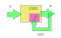
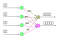
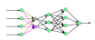
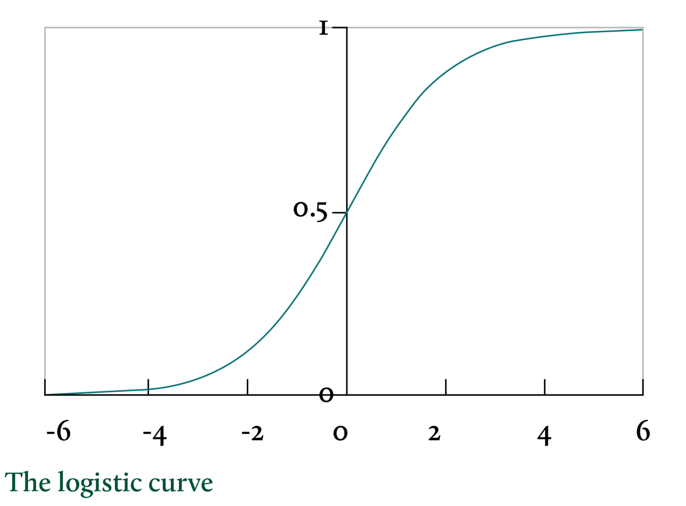
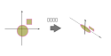
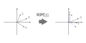
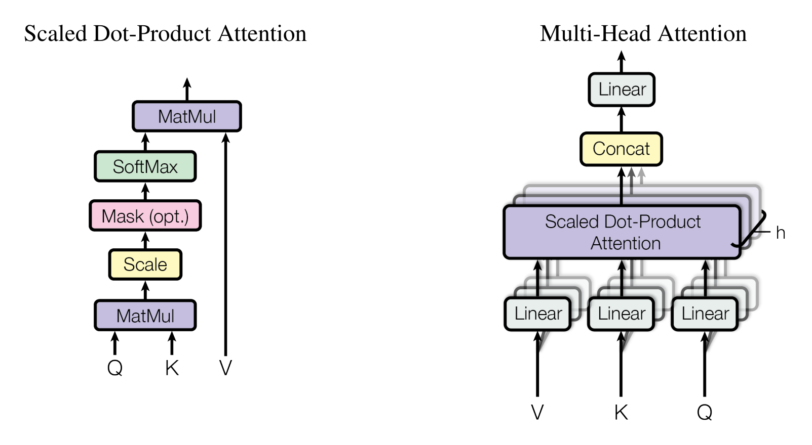
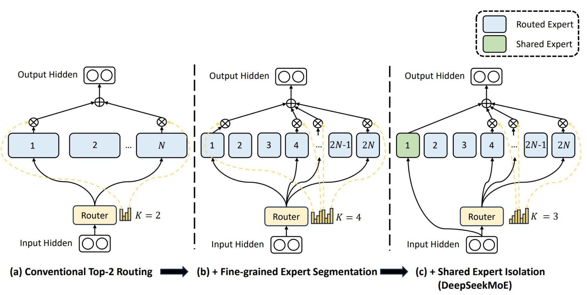
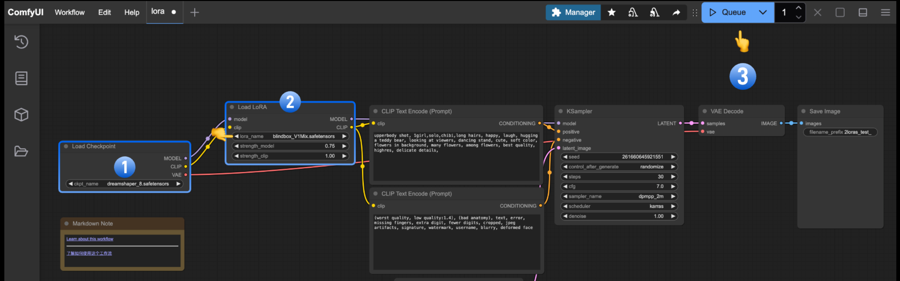
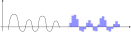

.. Kenneth Lee 版权所有 2025

:Authors: Kenneth Lee
:Version: 3.0

V3的说明
********

介绍
====

如果读者看到这一段文字，说明您看的是本书3.0以上的版本。

我决定要升级这个版本的主要原因是这几年大语言模型（LLM）有了很大的发展，为我们
解释《道德经》提供了更多的概念工具，让我们可以更容易沟通《道德经》里面描述的概
念。我希望引入这些概念工具来帮助读者更好理解《道德经》想要表达的东西。

我不希望上面这个表述让不是LLM领域的读者感到焦虑，觉得这个版本会让你看不懂。实
际上我没有打算改变本书的整体描述内容。你可以认为这个版本我只是增加了给不是做
LLM的读者一些科普，让你可以更好理解大语言模型是怎么工作的。在你理解这些细节后，
你就会形成新的概念，我们就可以用这些概念更好地认识《道德经》所表达的内容了。

这个道理就好比你没有见过狗，也没有见过猫，我给你形容狗，这会很困难。但如果我搞
到一只猫给你看看，之后我再用猫去类比狗，这个沟通就容易多了。

这里的“猫”，就是我们在沟通“狗”的时候用的“概念工具”。

所以，我们也不是像某些喜欢附会的人那样，说什么“老子在两千多年前就已经参透LLM
了”。LLM的概念可以用于理解《道德经》，是因为它们研究的是同一个领域：语言的特征。
但老子研究语言的特征是为了解决高层决策的问题，而LLM研究语言的特征是为了解决知
识的抽象问题。

认识LLM
=======

我们很多人对LLM的具象认识就是使用ChatGPT、DeepSeek、豆包等这些工具的认知：聊天
机器人。这个东西很像一个人，你问它问题，它回答你问题。

过去计算机模拟的聊天机器人大部分都是基于“逻辑思维”的。什么意思呢？就是你输入一
句话，计算机必须通过一组逻辑判断，根据这些逻辑判断固定返回特定的回答。

这种判断模型经常是这样的：

无论你问什么，它都必须进行“逻辑分类”，然后根据不同的分类走入不同的逻辑子类，然
后决定某种固定的反应。很明显这种“智能”非常死板，它更像人的“记录”，而不是人的
“智能”。人的语言行为非常复杂，有大量的情绪、隐喻和随意性在其中。这些东西用这种
生硬的模型是模拟不了的。

而现在的LLM可以表现得非常拟人。比如下面是我和用ollama运行的一个DeepSeek-R1:32b
蒸馏模型对话的记录（其中“>>>”开头的行是我的提问，后面是LLM的回答）：::

  ~ % ollama run deepseek-r1:32b
  >>> 《道德经》是讲什么的？
  <think>
  嗯，我现在要回答关于《道德经》的问题。首先，《道德经》是谁写的呢？我记得好像
  是老子写的，对吧？他是道家学派的创始人。这本书的名字是不是也有其他说法？比如
  有时候叫《道德真经》或者《五千言》，因为它的字数大概在5000字左右。
  
  然后是内容方面，我听说《道德经》分为上下两部分，上篇讲“道”，下篇讲“德”。那
  “道”具体指的是什么呢？好像是指一种宇宙的根本原理，是无形无名的东西。我记得里
  面提到过“道可道，非常道”，这句话的意思是不是说能用语言表达的道就不是永恒的道
  呢？
  
  再说“德”，下篇可能更多的是讨论人应该如何遵循“道”的原则来生活和治理国家。这里
  涉及到的内容可能包括自然法则、无为而治等思想。无为而治听起来像是不强制干预，
  让事物自然发展。
  
  我还记得里面有一些著名的句子，比如“上善若水”、“无欲则刚”，这些都说明了老子提
  倡的处世之道。是不是还有关于柔弱胜刚强的思想？这部分可能强调以柔克刚，避免直
  接对抗，转而用柔和的方式解决问题。
  
  另外，《道德经》不仅是一部哲学著作，也被视为智慧之书和人生指南。它教导人们如
  何生活得更自然、更和谐，同时对政治和社会管理也有深刻的见解。比如“治大国若烹
  小鲜”这句话，是不是意味着治理国家应该像煮小鱼一样，火候要掌握好，不能太急躁？
  
  我还想，现代人读《道德经》有什么意义呢？可能在于它提供了一种不同的思维方式和
  生活态度，尤其是在现代社会快节奏、高压力的情况下，学习如何保持内心的平静和自
  然。此外，它对个人修养和社会和谐都有指导作用。
  
  不过，我是不是遗漏了一些内容？比如，《道德经》中还有关于战争的观点吗？好像有
  提到“兵者不祥之器”，主张尽量避免战争，推崇和平解决争端的方法。
  
  总的来说，《道德经》是一本涵盖哲学、伦理学和政治学的综合性著作，强调顺应自然、
  无为而治以及个人修养的重要性。它对后世影响深远，在中国乃至世界文化中都占有重
  要地位。
  </think>
  
  《道德经》，由老子所著，是道家学派的经典之作，全书约五千言，又名《道德真经》。
  该书分为上下两篇，上篇探讨“道”，下篇阐述“德”。老子的“道”被视为宇宙的根本原理，
  超越语言和形态，如其开篇所述：“道可道，非常道。” 下篇则强调人应遵循“道”的原
  则生活与治理。
  
  《道德经》蕴含丰富的人生智慧，提倡无为而治、上善若水及以柔克刚等理念。它教导
  人们追求内心的平和与自然的生活态度，同时对政治和社会管理提供深刻见解，如“治
  大国若烹小鲜”，强调治理的细腻与节制。
  
  在现代社会，《道德经》的价值体现在其独特的思维方式和个人修养指导上，帮助人们
  应对快节奏生活中的压力，倡导和平解决争端，避免暴力。总之，《道德经》不仅是一
  部哲学著作，更是涵盖伦理学和政治学的智慧之书，在中国文化乃至世界文化中具有深
  远影响。

  >>> 有什么证据证明它分了“道”，“德”两篇？它原文这样说了吗？
  <think>
  嗯，用户现在在问《道德经》为什么分为“道”和“德”两篇，有没有原文这样说的。首先，
  我得回忆一下《道德经》的结构，确实通常认为上篇是讲“道”，下篇是讲“德”。那是不
  是在原文里有提到呢？我记得第一句话就是“道可道，非常道；名可名，非常名。” 这
  应该是在说“道”的部分。
  
  然后，第二章开头是“天下皆知美之为美，斯恶已；皆知善之为善，斯不善已。” 这一
  部分似乎还是在讨论价值判断，可能属于上篇的内容。接着到了第三十八章，“上德不
  德，是以有德；下德不失德，是以无德。” 这里明显是在讲“德”，所以可能从这一章开
  始转向下篇。
  
  另外，第八十一章是全书的结尾，提到了“信言不美，美言不信；善者不辩，辩者不善；
  知者不博，博者不知。” 这部分总结性的内容，似乎是在收尾，结束关于“德”的讨论。
  
  所以，虽然原文并没有明确标出上下篇，但通过内容的变化和主题的转换，可以看出分
  为“道”和“德”两大部分。上篇主要探讨“道”的哲学概念，下篇则转向如何实践“德”。这
  种分法方便后人理解和研究，尽管是传统上的划分，但也符合文本本身的逻辑结构。
  </think>
  
  《道德经》虽然没有在原文中明确提到它分为“道”和“德”两篇，但这一分法是后世学者
  根据内容的逻辑和主题演变而来的。以下是支持这种分法的主要依据：
  
  ---
  
  ### 1. **内容的主题变化**
     - **上篇（前37章）**：主要围绕“道”的哲学概念展开。
       - 第1章开篇即讲“道”：“道可道，非常道；名可名，非常名。”
       - 后续章节探讨了“道”的性质、作用以及与自然和人类的关系（如“无为而无不为”
         “上善若水”等）。
     - **下篇（后44章）**：主要围绕“德”的实践展开。
       - 第38章开始转向对“德”的讨论：“上德不德，是以有德；下德不失德，是以无德。”
       - 后续章节更多涉及个人修养、治国之道以及社会伦理。
  
  ---
  
  ### 2. **语言风格的变化**
     - 上篇的语言更为抽象和哲学化，多用比喻和象征来描述“道”的本质。
     - 下篇则更加具体，讨论如何将“道”的理念应用于日常生活和社会治理。
  ……
  
  虽然《道德经》原文并没有明确提到上下两篇的分法，但这种划分是基于内容逻辑、语
  言风格以及后世学者的传统解读而形成的。它有助于更好地理解和研究这部经典著作。

虽然我认为它的回答并不靠谱，但你不能不说，它确实更像一个“人”了。它甚至还有一个
思维的过程，先考虑你的意图，然后才正式回答你（这是一种称为“思维链”的技术，不是
每个LLM都会用到，我们后面会更详细一点去讨论它。）这是靠前面那种粗糙的决策树不
可能做到的。

这样的对话能力过去对计算机是个巨大的挑战，因为传统的计算机基本上是用来做逻辑或
者说“数值”运算的。你让它计算3+3等于几，或者如果3+3大于5就输出6，否则输出1……这
些东西传递给计算机都很容易做到，但你要让它谈谈对3+3=6的感想，并据此写一篇三百
字的议论文，这它就没法弄了。也许你可以内置一个回答给它，让它固定回答这个，但只
要你针对它的回答再问一句，这个组合逻辑它没法都内置，它就会回答得牛头不对马嘴。

这里的关键在于，计算机的逻辑都是人教给它的，除了复合逻辑，人都没法教它其他东西，
而我们人自己不是这样学习知识的。

维特根斯坦在他的《逻辑哲学论》（我看的英文版本叫Tractatus Logico-Philosophicsu》
中用了6章来描述他的逻辑概念定义和表示法，而最后一章，只有一句话（中文是我翻译
的）：::

  What we cannot speak about we mush pass over in silence.

  我们不能说的，必须在沉默中传递。

我看的版本的英文翻译者（D. F. Pears和B. F. McGuinness）在前言中把这句话补全
了：::

  what can be said at all can be said clearly, and what we cannot talk about
  we must pass over in silence.

  能被说的可以被说清楚，而不能被说的，我们必须在沉默中传递。

也就是说，通过逻辑，能说清楚的我们都能说清楚，我们不能说清楚的，只能意会。

请注意，这是逻辑，不是“沉默是金”这种心灵鸡汤。

“苹果是红的，这个水果不红，所以它不是苹果。”这句话可以说清楚，这是逻辑的。但什
么是苹果？什么算水果？苹果是一种水果吗？……这没有说清楚，我们的“清楚”，是在逻辑
空间中清楚的，但某个物体我们认为是苹果，这个东西是“你知我知”，这个东西是在沉默
中传递的，它不是我们逻辑空间中的一部分。

你当然可以进一步解释什么是苹果，什么是水果。但你永远需要其他概念去解释它，这些
概念具体是什么，就必须在沉默中传递。

传统计算机擅长解决的是逻辑空间中的问题，逻辑永远都可以出来一个结论，最多只是计
算快慢的问题，但它不能解决“在沉默中传递”的问题。这是因为，我们人就只能把自己思
想的“逻辑”部分传递给他，我们没有能力传递我们自己都说不清楚的那些“你知我知”的东
西给它。就算它产生一些随机的信息出来给你，你也不觉得它有“智能”，因为你和它不能
“你知我知”，没法共情。

具体一点来说，计算机要求你先定义了a=3, b=4，它可以给你推理a*b=12，但为什么a=3，
b=4，这是你要预先定义的。这就是维特根斯坦理论中的“逻辑”的部分，逻辑要求你先定
义了属性，然后在这个概念空间里面推理，这个推理过程就是清晰无误的，但预先定义之
前的部分，都是“不可言说”的。

理解这一点，我们就容易明白《道德经》说“道”不可“道”的含义了。“道”包含无数细节，
我们感知到它的是它影响的我们对这个世界的认识（“名”），我们谈的也是我们这个“名”，
但这个“名”并非“道”本身。所以《道德经》说的“天地”，并不是真实的，它是我们对“道”
的认识，是“名”。《逻辑哲学论》说的“World（世界）”也一样，它是我们对Thing（“东
西”）的认知，不是Thing本身。

“道”可以用名去“道”，但“名”只是“道”的一个我们自身的一个“关注点”（妙），不是“道”
的本体，也不是它的全部信息。名是道和我们本身的感官共同作用的结果，它包含了我们
自己的成份在里面。所以名里面包含了“众甫”（使用这个名的人）的本身的信息，我们看
名不但看到了“道”的部分特征，我们也看到了“众甫”的部分特征。商人描述的黄金和矿工
描述的黄金包含着不同的信息。

我们这里介绍LLM，就是用一个更加直观的方法，让大家感受到这个在沉默中传递的东西
具体是什么样的。看看我们觉得没法“数字化传递”的那些恍恍惚惚的“你知我知”的概念，
是怎么通过明确的数字传递过去，让冷冰冰的机器，也能和你“共情”的。

大语言模型的数学原理
====================

线性回归
--------

本章我们用线性回归来来解释一下机器学习最基本的原理。

如果你不记得线性回归具体怎么做的，不要紧，你大致知道它是什么东西就行了，相关的
知识我们后面会一点点给你提回来。但如果你说你完全不知道“线性回归”是什么，那这个
V3的升级的内容不适合你。不过，这不影响你继续看这本书，少数地方提到LLM有关的比
喻，你略过就是了。我会明确分隔这部分内容的，没有数学基础的可以把这些内容整体忽
略掉。

还有些读者可能有非常丰富的机器学习知识，这种情况我建议你可以加快阅读速度，但我
不建议你跳过这些介绍，因为你的抽象方法不一定和我的抽象方法是一样的。

最简单的线性回归方法是尝试得到这条方程的两个参数（a和b）：
:math:`y = ax + b`\。

假定你有两个指标x和y，比如给水缸放水的分钟数和水缸的高度，或者说开车的时间和开
车的距离之类的，你进行很多次的测量，知道很多个(x, y)的值，现在你想知道a和b，以
便以后你知道x就可以预测到y，这个通过很多的(x, y)的经验数据得到a和b的方法，就叫
“线性回归”。

当然，如果是纯数学，凭初中的数学知识，我们知道只要两对(x, y)，我们就可以得到两
条二元一次方程，就足够解出a和b的值了。但工程上，我们每个测量结果都是有误差的，
所以实际上我们是有很多的(x, y)，然后我们尝试获得“最好”的a和b，让所有的(x, y）
的综合误差是最小的。这个算法就比解方程复杂一点了。

一般我们会先人为定义一个误差函数（称为loss，比如均方差就是一种常用的loss函数），
用来评估我们不同的a和b，造成多大的误差。然后我们把所有的(x, y)（注意，我们这样
说的时候，(x, y)是向量，包括所有的点）输到loss中，我们求a和b等于多少的时候，
loss能达到最小值。

这有很多数学方法，但在机器学习中用得最多的是“梯度下降法”。基本原理是先给a，b设
定一个随机的值，然后在(a, b)的位置上，对loss函数求偏导（注意，对于loss函数，
（a，b)是变量，而(x, y)是常数了），然后把a, b各自向着偏导的方向移动一个小Delta
（称为Learning Rate），如此反复多次，loss就可能向着最小值慢慢下降了。

这个具体要多少次常常是试出来的，调整Delta不断比较loss是不是可以接受，通常慢慢
就能找到越来越好的a，b的值了。这里有很多细节的工程问题需要解决，比如这个
Learning Rate设置多大才能平衡效率和过度调节的问题。但原理就是这么个原理了。

线性回归是最简单的机器学习方法了，我们可以通过它来对比人脑的学习过程：我们把(x,
y)称为“训练集”，这是我们的“经验”，它相当于我们认识世界的时候不断看到的世界的规
律。而(a, b)就相当于我们的大脑，我们在小孩的时候，a, b可能是些随机的值，但我们
看见了，听到了，摸着了，得到了很多的经验，这些经验改变了我们的a和b，我们就记住
了一些东西了，这个a和b，我们称为“参数”，“模型”，或者“模型参数”。然后我们再遇到
一个新的x，我们就能进行“预判”，对y是多少就有了一个预期了。如果我们把这个过程看
作一个黑盒方程，学习就是一个这样的东西：

我们感受到外界的信息，根据这个信息和的内部参数综合做出决策，然后这个决策会给我
们反馈，这个反馈和输入共同构成(x, y)，改变我们的内部参数，然后影响我们的下一个
决策，我们就在这个过程中，反复改进我们脑子中的模型参数，这些参数，和输入输出不
是直接相关的，但输入输出又和它们有千丝万缕的关系。

神经网络
--------

简单的线性回归只有两个参数，通用的线性回归算法x是个向量，线性方程变成：

.. math::

  y = a_1x_1 + a_2x_2 + ... + a_nx_n + b

这可以容纳更多的参数，但数量也非常有限，这几个参数形容不了世界的复杂性。世界的
规律不是线性的，甚至不是多项式可以表达的。

数学家发现了一种可以容纳更多参数的，可以适配各种各样的“规律”，这就是“神经网络”。
神经网络这个名字听着很神秘，其实作为方程，它是很简单的，如果用大白话来形容，你
可以把它称为“权重加成”。

在介绍这个方程前，让我们再回顾一下线性回归的原理：你学习的可能是“放水时间”和
“水池高度”这两者的规律，但你学习以后，你记住的是“斜率”和“截距”这两个概念。这是
不是很奇怪？放水时间和斜率，似乎是风牛马不相及的，但它们之间居然存在规律！

记住这个特征，人脑记住规律就是这么做的。

大部分时候，我们考虑问题，其实就是把很多的规律（参数），这个多少份，那个多少份，
糅合到我们的参数中。比如说，一个游戏角色好不好，我们拿他30%的武力值，40%的智力
值，25%的敏捷和5%的防御，权重一加，我们就去和其他角色比高低了。

这个[武力，智力，敏捷，防御]的向量，乘以[0.3, 0.4, 0.25, 0.05]的向量（这种乘法
称为“卷积”），就是一个权重加成，可以得到这个角色另一个角度的考评，这种考评结果
也是一种向量比如[招聘费用，战场生存力]。神经网络就是一个这样的计算过程：

所以，尽管说得神秘兮兮的，这个神经网络的算法其实非常简单。就是把每个输入都做一
个权重加成，然后全部加起来，得到另一个维度的不同参数而已。它被称为神经网络，因
为它的样子很像人的大脑神经组成结构：这个方程的输入就是一个个神经元的触觉，触觉
感知到前面的刺激，就把这种刺激传递给下一个神经元，这个连接前后神经元的组织是可
以被“训练”的，所以这里这些[40%, 30%, 25%, 5%]遇到反馈后，就会发生改变，产生“学
习”。下一级把这些刺激收集起来，可以传递给下一级。这样会产生一个多级的传递和学
习结构：

这种结构伸缩性很强，你可以在每层上任意增加更多的神经元，它的内部权重的参数就增
加了，你也可以增加更多的层，这样整体也会产生更多的参数。

有一个这样的算法，我们就得到一条比线性回归（包括任意曲线回归）更大，更自由的方
程。这个方程，就称为“神经网络”。很多刚接触神经网络的人都把这个东西理解成现实世
界互联网网络那种“传递信息”的东西（比如光纤，wifi等）。实际上这两者不是一个意义
上的网络。“神经网络”形容的是这条方程的组成形式。它本质是一个方程，不是一种传递
信息的介质。

当然，前面我们只是介绍原理，在实践中，我们其实除了权重还会加上线性回归一样的
“截距”偏置，以便在某个权重上产生本身的“权重”（和任何输入无关）。我们还会通过把
结果叠加一个“激活函数”去对结果进行过滤。这个目的其实主要是“非线性化”。前面我们
说过了，线性回归做梯度下降的前提是方程可导，但权重计算基本上形成的是一条折线，
这会让结果常常是不可导的，所以，加一个要素进去，让这个结果不要对输入反应得那么
“生硬”，这些激活函数通常不会对输出造成很大的改变，就是简单让它“柔和”一点而已，
比如下面这个Sidmoid函数就是一种常用的激活函数：

所以，作为忽略工程实现的原理理解，我们基本上理解权重的部分就够了。

神经网络常常被比喻成人脑的神经网络，其实不利于有数学思维的人理解的。让我给你换
成线性代数的概念你就好理解了。

前面我们用游戏角色的例子展示了神经网络是怎么把武力-智力-敏捷-防御这个四维向量
转换为一个招聘费用-战场生存力的二维向量的。线性代数没有忘光的读者应该很敏感地
发现了，这其实是一个“线性变换”。线性变换就是坐标系只做加权或者旋转变化的变换：

线性变换能维持原始坐标系的很多特征，比如平行线会保持平行，所有面积都保持等比例
缩放，等等。如果不考虑严格的数学定义，你可以认为线性变化是一种“变换后你还能大
致认出原来的图形是什么样子的”的变换。

使用线性变换，原坐标系的任何一个坐标，都可以用相同的变换算法转换为新坐标系的点。
而这个算法就是前面说到的“权重加成”。最后就可以表达为一个矩阵乘法。

比如你有一个4维的变量[x1, x2, x3, x4]，乘上一个4x2的变换矩阵，你就可以得到一个
2维的变量[y1, y2]，计算方法就是：

.. math::

  y_1 &= k_{11}x_1 + k_{12}x_2 + k_{13}x_3 + k_{14}x_4 \\
  y_2 &= k_{21}x_1 + k_{22}x_2 + k_{23}x_3 + k_{24}x_4

对应的变换矩阵就是：

.. math::

        \left[ {
        \begin{matrix}
                k_{11} & k_{12} & k_{13} & k_{14} \\
                k_{21} & k_{22} & k_{23} & k_{24} \\
        \end{matrix}
        } \right]

所以，从理解算法的角度我们不需要想那么复杂的神经网络结构。其实每个神经网络(层）
计算，就是一个变维的过程：我们输入一个向量，乘以变换矩阵，得到变维后的向量。也
就是同一个问题，在另一个维度上的认知。

扩展一下，如果我们把前一个坐标系的t个坐标合并起来组成一个矩阵，把这个矩阵乘以
变换矩阵，我们会得到一个t个坐标组成的后一个坐标系的矩阵。换句话说，变换矩阵不
但可以作用在一个点上，也可以作用在一组点上，把每个点都做一样的线性变换。我们很
容易把前一个坐标的一个图形，变化为新坐标系的新图形。记住这个小特征，它对我们后
面理解Transformer模型会有帮助（其实这对几乎所有具体的大模型都很有帮助）。

这给了我们一个新的方法来理解我们道德经的“恍惚”的概念。比如你看到一只猫，我们把
你的眼睛看作是一个传感器，它捕获了1000个点的颜色，这个包含1000个数据的向量，就
是你的恍惚，你都看见了，但你的神经网络对它进行了变维，变成了2000维的空间的坐标。
现在你告诉我，这个2000维的数据表示什么？要说出来的话，我也只能说这是“猫”的信息，
但其实你非要说它是什么，看起来它就是一个2000维的一个向量。什么时候它是“猫”呢？
只能是这个2000维的数据穿过整个神经网络，经过一次次的变维，最终变成“猫”这个
Token（Token的概念我们后面介绍Transformer的时候回过头来讨论）的时候了，这时，
它就是一个“名”。

当我们细细地打开我们大脑的思考过程来看这个问题，我们就能更清楚看明白“名”和“道”
的差距有多大了。从恍惚开始，你就已经离开“道”了。你的信息被反复变维，从各个角度
来寻找潜在的规律，最终形成了你的一组Token（名），这就是你的认识。

现在我们可以抽象性地理解神经网络了，它是一条包含大量参数的方程，这些参数用作输
入的变换矩阵，让我们从不同的维度去变换我们原来的认识，并且在这种认识的高层抽象
上进行再次认识，从不同的层次上发现规律，记录在这个层的权重参数中。

神经网络每层的变换矩阵（又叫“权重矩阵”）就是它的“大脑记忆”。外部的刺激被权重矩
阵所“判断”，形成了我们的认识，“认识”的规律反过来修正了我们的权重矩阵，改变我们
未来的“认识”。我们被外界的刺激中包含的规律和权重参数改变我们的认识，又认识反过
来改变我们的权重参数。所以，学（接受刺激）而不思（通过反复递归我们的Token优化
我们的权重）则罔，思而不学则殆。

神经网络中，把方程输入输出的两层称为“显层”，把中间的其他层称为“隐层”。有了这个
概念，我们就很容易理解《道德经》中说的“名和恍惚”两个概念是什么了。名是我们明确
形成的概念，是我们在输出层上看到的数据，而恍惚是隐层的权重，这个信息存在在我们
的脑子中，但我们不知道它是什么，我们说不出来，因为说出来的就是我们输出的Token，
但我们还有大量从不同维度理解这些信息的“隐层权重”，这些东西你说它“没有”呢，这不
对，因为我们还是能感知到它，但你说它有呢，你确实也说不出来。

我觉得，老子能在那个对这些基础研究都没有的情况下，直接感知到“恍惚”这个概念的存
在，感知能力实在是非常强了。当然，我个人更认为这不是老子一个人发现的，这应该是
我们的祖先进行大量的概念归纳后的共同智慧，否则它不可能这么指向明确地保留到今天。

Transformer
===========

综述
----

Transformer是一种面向大语言模型的神经网络，现在几乎所有的大语言模型都是基于这
个结构的模型来实现对话的。像我们很熟悉的OpenAI，DeepSeek，千问这样的模型，都是
基于这个神经网络的结构的。当然，都有不同的改变，但这不影响我们通过这个基本的模
型去理解大语言模型是怎么对输入的文字进行变维，最终变成一种“智能”的。

Transformer这个概念来自一篇Google公司的论文，叫《Attention Is All You Need》，
翻译成中文就是“你需要的只有注意力”。这是直译，你不要当作一般人的语义来理解，不
要觉得这是让你集中精神。这句话的意思是：我们做了各种大语言模型的实践以后，发现
整个算法核心其实就只有“注意力”（这个算法）。

其中Transformer这个单词直译是“转换器”，它也是著名的漫画和电影《变形金刚》的名
字，表示那些可以“变身”成汽车的机器人。我花时间把这两个语义介绍给读者，其实也是
想强调一下：两种不同的语言，几乎是没法用一一对应的方式来翻译的。古人说的牛马，
和现代人说的牛马，就不一样。大语言模型的“转换器”，和可以“变身”的机器人也不是一
个东西。中文的机器人和英文的Android或者Robot也不是一个意思。注意到这个特征，也
许有利于你理解Transformer的工作原理。

我们这里不翻译，把这个算法叫Transformer，主要就是想用它被创建时的原始语义。你
可以想象如果我们把这个东西叫“转换器”，你很难不把它和泛泛的转换器的概念联系起来。

很多人批评英文在每个领域都创建了很多新词，不利于交流。其实这是把某个领域研究精
细以后的必然选择，因为你就是要在这个领域创建独一无二的概念，好和其他概念区分。
所以我们做计算机的，也愿意在中文中插英文概念，因为这样我们就可以和我们日常用的
那个概念区分开了。这个问题不是中文本身的问题，英文一样存在，如果你经常看论文或
者看数学证明，里面大部分变量都用罗马字符或者拉丁字母表示。这也是为了换一种语言
来表达一个“独一无二”的概念。

Transformer的算法主要是论文中下面这张图描述的：

没有神经网络的基础，可能你不知道这个图是什么意思，有神经网络基础，我们还是很好
看懂它的原理的。

首先，这个图中的每个框，就是一个神经网络的层，里面带着自己的权重，可以训练，你
输入的问题，变成一个矩阵，把这个矩阵输入到神经网络中，进行一次次的变维操作，根
据变换矩阵（后面我们统一叫权重矩阵，前面的名字强调它对输入的改变作用，而权重矩
阵强调的是它类似人脑的“记忆”功能），变成一个内部的“认知”（恍惚），这种恍惚的信
息一层层传递，最后变成一个感知的输出，形成“概念”，变成说出来的对话，这就是
Transformer的效果。

和人不一样，Transformer的认知过程和训练过程是互相独立的，你和Transformer对话，
它和一层层的权重矩阵进行计算，最后输出对话，这个过程中权重矩阵是不改变的。

而训练是一个独立的过程，你给它输入大量的文档，小说，文档，程序，对话，论坛的帖
子等等，Transformer用前面说的话和后面的话进行“规律匹配”，通过梯度下降算法训练
权重，让权重和这个规律实现“最小loss”，这个原理和线性回归是一样的。但人肯定是不
用成本这么高的算法来训练自己的脑神经，具体它是什么方法，我也不知道。反正肯定不
是这个方法（当然，人脑也记不住现在大语言模型记住的那么多信息）。但无论如何吧，
Transformer在使用的过程中，它的脑子就不再“成长”了，这一点和我们人是不一样的。
虽然你也确实可以把你后来和它的对话也放到它的训练数据中，但这两个过程是互相独立
的。

我强调这个，主要是想告诉你，现在的神经网络，还和人是不一样的，你不能完全把两者
对等，但研究神经网络，确实有助于我们类比我们很难用语言来表达的人脑的机制。

我们接着说这个结构的总体原理：这个图分成左右两个部分，你可以看到它有两个输入一
个输出。为什么会有两个输入呢？我们看看它的用法你就知道了。我们设想一个对话：::

  你：你好
  AI：你好，有什么可以帮你？

这个对话中，输入就是“你好”，输出是什么呢？——嗯，不是后面那句话，而是“你”。整个
神经网络，只计算一个单词（称为Token），这个计算完成后，再次在右边的输入上输入
“你”，得到“好”，然后把“你好”输入到右边的输入上，如此类推，得到：::

  ，
  有
  什么
  可以
  帮
  你
  ？
  <EOD>

最后一个Token表示对话暂时结束。所以，你会发现，这整个计算过程，其实一直都是用
前文推断后文。所以，整个AI对话，其实就是一个“补字游戏”，你不一定用它来对话，你
完全可以写一些文字作为开头，然后让AI补全后面的文字。

所以，几乎所有的LLM模型都可以用来做文字补全，比如你给它“白日依山尽”，可能它会
给你补成“黄河入海流”。由于你用这句文字“训练过”它，它的权重里面“记住”了这个“规
律”，所以它大概率会这样回答你。

至于它为什么能被训练出“对话”的规律，那是因为这部分的训练数据是这样的：::

  <User>你好</User><AI>你好，有什么可以帮你？</AI>

所以，它也学会了对话类型的连串语句的特征。

从这里可以看到，就原来来说，“对话”和“补全”是同一个东西，我们介绍原理就介绍一个
就行了，后面我们都用“补全”作为例子来讨论我们的问题。

Tranformer这个“方程”，就是用一组神经网络层，充分暴露语言的特征，从而用权重记住
这些特征。整个Tranformer网络设计的重心，就是怎么把语言的规律充分暴露出来，让它
在信息传递中尽量贴近人的思维特征，保留人思维会保留的特征，放弃人思维不保留的特
征，从而让它“像个人”。

基础结构
--------

Tranformer模型分成两个左右两个部分，看起来非常接近。这个结构的基础来自过去的翻
译软件。比如中译英。用过这种软件的读者应该知道，要做好整个句子乃至整个文章的翻
译，你是不能一个单词，一个单词去直译的。因为两种不同的语言不是一种语言一种语言
一一对应的。强行一一对应翻译就会造成这种结果：::

  What's your name?
  什么是你的名字？

这个显然很生硬，因为中文问人家名字是这样问的：“你的名字叫什么？”

这还算好了，复杂一点的遇到更多一些多义词，不联系上下文你根本不知道那个词应该译
作什么。

所以，翻译软件会先把输入先翻译成一种“内部表达”（权重），然后再把这些内部表达，
重新表达成另一种语言。这两个过程，就叫Encoding和Decoding，前者把一种语言转换成
内部表达，后者把内部表达转换成另一种语言。

这两者几乎是完全一样的，只是训练了不同的权重而已。Transformer继承了这个结构，
所以它就有左右两个几乎一样的部分。你可以认为它就是一个翻译软件，把“问题”翻译
成“回答”而已。

对于这个结构，我更想提醒读者的是：神经网络的设计，和一般设计普通的计算机算法很
不一样。我们前面就说过，一般计算机算法设计的是“逻辑”。它是严格的，清晰的。设计
多少层，每层应该是什么……这是有明确的“因果”关系来支撑决策的。但神经网络多一层少
一层，有时根本不影响什么，因为训练过程会让这一层也向“实际的规律”靠近，这也没有
精确的逻辑关系可以说。神经网络的算法设计，更重视的是如何“充分暴露重要的规律，
隐藏多余的，没有意义的规律”。理解这一点，我们才能理解我们后面讨论的重点。

Token vs. Embedding
-------------------

Transformer的输入是Token，就是“包含某种意思的词语”，让我区分一下：

当我们说“道德”的时候，和我们说“道”的时候，我们期望表达的含义是不同的。所以，就
“意思”来说，“道德”和“道”，是两个Token。我们脑子里面思考“道德”的时候，是作为一
个整体来思考它的，但我们有时又确实是把两者“关联”起来了。比如有些人想要拽文，说
不定就会说出“道德，道德，必然要出乎道才能合于德”。如果道德和道是两个东西，我们
不会说出这样的话。这说明在我们的脑子里，这两个Token是有关联的。但如果我们简单
用一个数字来分别代表不同的Token，那么我们就会失去这种关联，而会创建另一种关联。

比如说，我们把所有的Token组织成一个列表，按顺序编码它，道排在11位，刀排在12位，
而道德排在1234位。这个数据输入到神经网络中，神经网络就不会认为道和道德有关联，
而会认为道和刀有关联，因为它们靠得很近。但我们人并不这样认为，所以，为了让神经
网络更像人的思考模型，我们必须让网络忽略道和刀的相关性，而注意到“道”和“道德”的
相关性。

所以，Transformer不用Token的字典下标来表示Token，它用整个字典所有Token的权重来
表示单个Token。

这句话不好理解，看个例子就容易明白了。比如说我们的语言很简单，只有10个Token：::

  你 我 道 德 刀 道德 我们 飞机 月亮 的
  0  1  2  3  4  5    6     7   8    9

为了表示“你”这个Token，我们先简单写成一个这样的向量：::

  [1, 0.1, 0, 0, 0, 0, 0.2, 0, 0, 0]

你可以看出来，这就是一个所有Token的权重矩阵。“你”这个Token，和字典中的“你”最接
近，所以它在“你”对应的字典位置，权重就是最高的（例子中的1），它和“我”这个Token
还有点关系，所以“我”的权重是0.1，而它和“道”没啥关系，所以权重就是0，……如此类推。

用这种方法表示Token以后，每个Token就只和其他Token有权重关系了，和字典顺序就没
有关系了。这些权重经过一些实际文字的训练，每个Token就会有一组特定的权重了。

以前很多LLM都通不过一种测试：比如你问它Happy中有多少个p，它是回答不出来的，因
为Token中并没有这个信息。但这个问题现在很多时候都没有了，这有很多办法解决的。
一个最简单的方法是用一组文字训练LLM，直接告诉它happy包含哪些字符。之后它就能建
立happy中有多少个p的知识联系了，这不需要LLM一个个去数的。（从这个角度说，你会
发现LLM的训练其实很像培养一个人。）

前面这个向量，就叫Embending，它的长度不一定是字典的长度。我们说过了，神经网络
可以任意变维的，你把一个100000个Token的Embedding统一用某个神经网络变维成1000个
维度，部分信息损失了，但特定的规律仍在，这个东西就可以用来表示不同的Token。

.. note::

  在机器学习领域，Embedding其实是个更通用的概念，它表示某个概念（“名”）包含的
  子信息。我们用一只猫的图的所有像素点的信息组成一个向量，这就是一个代表“猫”的
  Embedding，我们对这个Embedding进行变维，得到一个新的Embedding，它也能代表
  “猫”，但这个Embedding已经不在原来的维度上了。

  Embedding称为某个对象的“特征”，Embedding向量的每个参数称为这个对象的一个“特
  征参数”，包含更多参数的特征称为这个对象的“高维特征”，变维到更少特征参数的特
  征，那个特征成为原对象的“低维特征”。

  现在很流行的RAG（知识检索）就是一种这样的概念：一篇包含很多文字的文章，考虑
  其中的每个文字，那些信息组成了这篇文章的高维特征，RAG把它变维成一个低维特征
  表达，然后我们就很容易比较这篇文章的低维Embedding和其他概念特征的的“相似性”，
  从而一眼就看出某个概念和其他概念是否具有相关性了。

  可以看到，同一个对象的高维特征和低维特征的Embedding并不包含相同的信息，这其
  中大部分的信息其实表达的是对转换矩阵（也就是神经网络隐层）的一种“查询”。所以
  我在想：如果未来出现了一种碾压人类的智能存在。它可能是具有比人类大得多的隐层
  权重矩阵，它眼中的“猫”，包含的信息比我们多得多，它能发现的相关性也比我们人类
  多得多，也许能发展出我们完全想象不到的技术方向。

  幸运的是，这个世界还是物理的，人类白瞎了那么大的大脑，也不见得就能灭掉没多大
  大脑的蟑螂。穷尽你的思维，你最终也不过是拿出来一个物理世界的“决策”，大家还是
  在比物理特性。信息高度给我们带来文明，但并不能让我们为所欲为。

回到《道德经》的问题上，各位看了这个算法有什么感想呢？我最大的感想是对“名”和
“恍惚”有了切身的体会了。我们说的每个意思（Token），其实保存的时候是个向量，这
个向量变维后还是向量，多个Token组合在一起，也是向量。这是最直接的“名可名，非常
名”，每个Embedding说的都是那个Token，但每个Embedding都是不同的，而且也不是它要
表示的那个原始对象。没有Transform这个具象化的共识，我们很难说清楚名和道的概念，
因为没有两层语言去描述名和道。现在我们有了。

ROPE
----

Embedding的下一步，就是Positional Encoding。我们输入一句话让Transformer做后续
补全，这句话的每个Token组成一个Embendding的矩阵，输入给模型发现规律。但规律是
一个一个Embedding来计算的，和顺序无关，所以最好能让Embedding本身就带着顺序信息，
这个信息用什么办法加进去好呢？

Transformer用的算法是ROPE，它是ROtary Position Embedding的缩写，中文可以翻译为
“旋转式位置编码”，算法是欧拉公式\ :math:`e^{ix} = \cos{(x)} + i \sin{(x)}`\ 你
可以认为它的作用就是在高维空间中把一个向量旋转一个角度。

如果用两维向量来理解，就是说，你输入一句话：“白日依山”，每个Token被转换成一个
两维的Embendding，每个Embendding表示一个二维的坐标，而ROPE就把这个座标逐个旋转
一个角度，成了这个样子：

这里的“白”是第一个位置，不旋转，“日”是第二个位置，旋转一个\ :math:`\theta`\ ，
“依”是第三个位置，旋转\ :math:`2\theta`\ ，如此类推。这样，我们直接拿到
Embedding的时候，每个里面都有了一个和位置有关的信息，而且这个信息和前面我们用
权重处理Embedding一样，是整体嵌在每个权重上的，而不是一个分离的信息。

你会发现，现在“白”还是“白”，“日”还是“日”，但隐含着“第一个白”，“第二个日”这个信
息在其中了，而且这个旋转还是可以重复的，这和我们说话时的思考也很像：我们确实感
知到大致的顺序关系，但只要字数一多，其实我们只是记得一部分，我们不是严格按照某
个数字化的顺序去认识这个顺序的。

也许未来我们会发现更多更好的位置编码方法，但我们现在至少可以看出，大模型呈现各
种信息的思路不是“数字化”的，而是如何“整体上把信息隐含在另一个维度上”。

ROPE算法本身只有一个不训练的固定旋转参数，所以在那个图上，你会发现它没有占据面
积，说明它本身是不带可以训练的参数的。

Attention
---------

ROPE之后，就是Transformer的论文标题强调的核心概念，注意力（Attention），了。这
个算法在原论文有一个打开细节后的图示，是这样的：

这里的Q，K，V，分别表示Query，Key和Value。听起来是某种查询的行为，实际上不是，
这个名字来自Google搜素引擎的图片查询算法，那个算法用一个向量Q去和数据库中的向
量K做计算，去查询记录的图片V。Transformer借用了这个算法，但它的Q，K，V全部都是
原来的Embedding向量的变维结果。

所以你可以认为，如果你的输入是一个Embedding的矩阵X，那么Q，K，V就都是X的不同变
维。如果X表示“白日依（山尽）”，那么，Q，K，V也是“白日依（山尽）”，只是每个变维
的权重不同，所以强调的东西有所不同而已。这个计算的核心就是那个SoftMax，SoftMax
是一个相关性矩阵（称为ScoreBoard）生成算法，我画个图来展示一下：::

  Q
  |
  V   白  日  依  <- K
  白  r   r   r
  日  r   r   r
  依  r   r   r
  
纵横坐标是输入，r是两个维度对应对象的相关性程度。

这是把不同角度抽象出来的同一句话，计算词和词之间的相关程度。它叫注意力，说的就
是我们在说一句话的时候，会关注到前后文之间的关系，从而特别“注意到”说话者想强调
什么。整个注意力算法，其实就是在做一件事：把一句话分成三个角度的不同描述，然后
用Q，K来强调出这句话的上下文相关程度，最后乘回到这句话上（V），就把这句话重要
的部分“高亮”强调出来。

.. note::

  在实际的论文中，encode和decode使用的ScoreBoard是不一样的，decode的的
  ScoreBoard会切掉矩阵中一般对角的内容，这是为了避免“未来词”的影响。在对话的时
  候，当我们说白的时候，我们是不应该算“日”、“依”和它的关系的，所以必须去掉每行
  对于未说出来的话对前面的话的影响。这一点对优化KVCache等算法的存在有非常大的
  影响，在LLM技术中有很重要的作用。但对我们借用这个空间的关系不大。这里专门注
  释一下，是为了避免对读者建立对LLM的概念造成影响，但其实不影响用于针对道德经
  主题的理解。

Multi-Head Attention
--------------------

上面这个算法，可以用不同的权重矩阵，得到多组不同的注意力，然后组合在一起，这就
称为“多头注意力”。这里的“多头”，可以理解为“多个思考角度”。

用自然语言来表述这个东西就是说，你告诉我一句话，我从这个角度想一想，从那个角度
也想一想，最后组合在一起，这就是我理解这句话的意思了。用一个更具象化的例子来比
喻一下：你跟我说“白日依山尽”，我从“唐诗”的角度想想你的意思，再从“登山”的角度想
象你的意思，再从“学习精进”的角度想想你的意思，据此来理解这句话你要表达什么，然
后综合这些意思，这样我就可以正确理解你的想法，知道你实际想表达什么了。

这种算法，就叫“多头注意力”，它可以被重复多次（注意Transformer架构图中的Nx），
这就相当于我们对问题进行了多层都抽象，变维再变维，把逻辑层次抽到很高，最终决定
我们怎么思考和讨论这个问题。这就是整个Tranformer特征提取的核心。剩下的层，都是
标准的神经网络特征提取层，这时特征已经充分暴露了，就是用全连接层来充分提取规律
而已。如果不是研究算法本身，我们这里也不需要特别再介绍更多的细节了。

.. note::

   为了让逻辑完整（以便支持后面的MoE的介绍），这里简单解释一下FFN和Add&Norm层
   的作用。

   FFN，Feed-Forward Network是一个标准的全连接层，就是我们前面提到的标准的权重
   矩阵算法，它的作用就是学习。工程上，一般算法会把d维的Embedding降维成d_h维，
   分给h个头计算，所以最后的结果就不需要再变维了，因为所有的头合并起来维度会重
   新变成d，这样重复计算多次层之间的维度都是可以匹配的。

   Add&Norm是一种避免多层学习以后结果失真的算法。其中Add称为“残差”，就是把结果
   和输入加一下，这样结果始终不会离开输入太远。Norm有多种算法，但主要是让结果
   标准化，让整个结果维持在一个标准的范围上，比如让向量的均值为0，方差为1。这
   样结果就“标准化”了。所以，这个计算在每步后面都有一个，都是在保证无论迭代多
   少次，结果都不会走样，算是某种稳压电路吧。

Mixture of Expert
-----------------

标准的Transformer算法的多头注意力计算方法称为“密集注意力”，这种方法遇到任何问
题，都是要走过Nx层的计算，每层都要重复相同的学习网络的。这种方法的缺点是计算成
本高，而且也不拟人，因为人在思考的时候其实不会遍历性地把所有角度都思考一遍。所
以很多Transformer的变体（比如Deepseek），都会使用另一个改进，称为MoE，Mixture
of Experts。这算是一种“稀疏注意力”。原理从名字上也可以猜到了，它不会使用所有的
FFN网络，而是根据上下文不同，选择不同的FFN记忆（称为“Expert”，专家）。

下面这个图是DeepSeek的论文中对它的MoE的实现的模型图：

它的修改在FFN层上，在前面多头计算合并以后，输出FFN的时候，并不会只有一个FFN，
而是有一组，多头Add&Norm的后的结果在进入FFN层前，通过Router算法选择K个FFN专家
支持这一轮计算。

DeepSeekMoE算法把专家分成共享和路由两种，共享专家是每次必选的，路由专家通过一
个选择矩阵变维为一个专家数量的logits，得到所有专家的得分，然后选择K个最高分的
专家就行了。

MoE更接近人的思维，因为我们听人家说一句话，确实很少把各个知识面都考虑一遍，然
后组合出我们的思路，而是直接先大致决定这是哪个领域的话题，然后用那些领域的思考
来考虑这个问题的逻辑。这种少数的专业领域，就称为一个“专家（Expert）”，MoE机制，
就是用少数的“专家”取代所有的专家，让我们的思考迅速聚焦到特定的领域上。

到这里为止，我们已经解释完Transforer左边的网络了，右边基本上是左边的复制，基本
上不需要这里介绍。有些模型干脆就没有左边，其实全部按右边理解就可以了。这个论文
不少篇幅在介绍QKV这个算法如何通过保留KV的中间计算结果（称为KV-Cache）来提升计
算效率，但这已经是工程问题了，和我们这里讨论的问题无关，我们也不深入讨论下去了。

思维链
------

最后我们来讨论几个提示词层面的问题。

思维链技术的应用，极大地提升了LLM的“拟人程度”。它的用法在使用界面上就能看到，
我们一开始的DeepSeek例子就已经展现过了，LLM不会立即回答你的问题，而是先生成一
组前置的Token作为思考，然后才用这个思考的结果也放到输入中（输出的Token本来就是
要叠加到输入中才形成下一个Token的输出），控制后续的发展方向。

所以这个技术和Transformer模型本身关系不大，它主要是把人面对训练是如何思考的，
也放到训练数据中，这样每次听到一句话，训练的结果会优先输出思考的部分，然后再基
于这个思考的部分输出回答。

传统的LLM方法所有的“思考”，都在隐层中，它里面是什么，其实没什么逻辑，都是一个
恍惚中的直接反应，是没有逻辑的Pass Over In Silence。但如果先让这些没有逻辑的隐
层数据，先输出一部分Token，然后靠这些Token作为输入来稳固输出，LLM的应答就会更
有逻辑。

这种方法我自己有深刻的体会。作为程序员，我写代码前是必然要写设计文档的，设计文
档就是把我考虑的各种要素整理成一个个文字表述的“视图”，用这个视图的逻辑去稳固我
后续的设计，这个本质是加大逻辑空间的信息量，让逻辑性大于“感性的直觉”（隐层中的
无法解释的规律运算），从而让我们的推理的数字化程度更高，而我们知道，数字化对比
模拟化的因果，它具有更好的信息传递上的可靠性，这是做复杂的事情的必须的要素，因
为这样我们的逻辑可以持续传递下去，而不会因为传递过程中的损失而让最终结果完全偏
离我们的初衷。

建简单的平房，可以没有图纸；写简单的程序，可以不写文档；街头斗殴，可以不用安排
计划。但如果把这些换成盖高楼，写大型应用，发动战争等。不进行文字化，不基于文字
化的一个个“视图”进行逻辑推理，是不可想象的。从这个角度看，文字对人类文明的进步
的作用，是非常明显的。人脑可能有某些特殊的手段，可以在大脑中保留一些Token这种
明显的信息的，但做复杂的事情，我们还是会通过大量的文字工作，让我们的大脑可以同
时使用理性的Token和感性的隐层共同作用，得到更容易重复的逻辑推论。

.. note::

  严格来说，“写成文字”这种手段更接近现在在配合LLM使用的RAG
  （Retrieval-Augmented Generation）技术。这种技术通过特定手段（包括LLM自身递
  归产生的文字）去增强上下文，从而让LLM的输出变得更“理智”，减少“幻觉”。但“其出
  弥远，其知弥少”。我们就不越走越远，偏离我们的主题了。

Context
-------

我们前面说了，Transformer这个架构，输出是不断叠加到输入上来进行重新计算的，所
以这个计算过程越往后就越慢。这一点，我让你看一个实际的针对LLM的服务（WebAPI）
的请求是什么样的你就知道了：::

  {'max_tokens': 1024, 'temperature': 1, 'stream': True,
   'messages': [{'role': 'user', 'content': '为什么1+1等于2？'},
                {'role': 'assistant', 'content': '1 + 1 等于 2 是一种基本的
                  数学概念，它源自人类对数量的理解和符号表示。在现代数学中，
                  整数1加上整数1被认为是构成基本的组合，即“两”，因此被称作2。
                  这种规则在我们的数学系统中得到了定义和接受，使得我们能够进
                  行有效的计算和理解数量关系。\n\n这个概念也反映在其他数学分
                  支，比如代数、几何等领域，其中1和1的组合确实被定义为2。这种
                  定义的一致性是数学逻辑和系统的基础之一。当然，这个概念并非不
                  可改变，例如在某些文化或特定的数学体系中，对于1+1等于何者的
                  理解可能会有所不同。但在标准的数学逻辑框架内，我们接受1 + 1 
                  等于 2。'}, 
                 {'role': 'user', 'content': '如果我假设1+1等于3，可以推演出一
                  套新的数学体系吗？'}, 
                 {'role': 'assistant', 'content': '是的，理论上你可以建立起一个
                  基于这个假设（即1+1=3）的新数学体系。然而，这样的数学体系会与
                  我们现有的标准数学概念和逻辑产生冲突。在此体系中，为了保持一致
                  性，你需要重新定义其他基本数学概念，并建立一个全新的运算规则集。
                  \n\n例如，你可能需要定义一个新的“加法”操作符，它在两个1之间表现
                  出不同于我们目前认知中的“加法”（即2）的结果。这将涉及到创建新的
                  规则和定理来描述这一新的数学系统。\n\n然而，如果你想要与现有数
                  学体系相兼容或者能够在某种程度上与它交互（比如保留部分原有概念），
                  那么你可能需要引入更多新的原则和定义来使得这两个世界之间存在一种
                  接口。\n\n这类问题在数学哲学中经常被探讨，尤其是在探索不同文化或
                  非标准逻辑系统（如立方数根号系统）时。在逻辑规则固定的情况下，你
                  可以设计出任何一套数学规则集，但这样的体系在实用性、简洁性和广泛
                  接受度上可能面临许多挑战。'}, 
                 {'role': 'user', 'content': '尝试定义一下这样的体系？'}], 
      headers={'Content-Type': 'application/json'}
  
可以看到，虽然这一波我就跟它说了一句话：“尝试定义一下这样的体系？”，但我给LLM
发请求的时候其实是把我们说过的话全部发给服务器的，这些所有的话，就叫这次对话的
Context（上下文）。现在大部分LLM都没有能力把你说的话更新到它的权重中，所以，它
其实就是针对过往的知识（权重数据），和你的上下文，共同决定如何和你对话。但这个
对话的时间越长，它的计算成本就越高，反应就会越慢。而且由于一些计算技术的影响
（比如KVCache），它需要的内存也越多。

所以，大部分LLM都是有Context大小的限制的，超过一定的长度，LLM就记不住之前说过
的内容了。但这一点其实和人很像，人的思考也是有一个上下文的限度的。对写程序的人
来说，一个函数超过一定的长度，它的逻辑我们基本上也没法直接通过大脑去校验了。我
们只能进行分层，用一个名字代表一段细节，然后思考的时候就聚焦到这个名字上，不再
深入它的细节了。

就好比我们大部分人都熟悉的标准程序Hello World：::

  def main():
    print("hello world")

你这里的逻辑就只有“打印‘hello world’”，但实际上要求打印这件事就是很复杂的，比
如你首先可能要对字符串进行转码，要选择输出的通道，要和其他共同使用通道的线程进
行互斥访问。但我们思考这段逻辑的时候，我们就放弃它的细节了，这样我们才能聚焦在
这段逻辑上。这样在这个上下文里面，我们就容易做逻辑思考了。

如果我们把所有逻辑都放在一个Context里面去考虑，我们什么都思考不了。所以，“逻辑”
总在某个“上下文”（Cotext）中呈现，这也是架构设计中“视图”这个概念的本意。

LoRA
----

Context可以在不改变模型的情况下用Token改变输出，LoRA是一种不改变模型的权重的情
况下，用更多的隐层改变输出的方法。LoRA这个词是Low Rank Adaptation的缩写。Low
Rank是线性代数中的低轶空间的意思，具体这个算法怎么做到的其实我也不懂，但我们可
以直接说结果：它的本质就是在不改变原始模型的情况下，另外给原来的模型增加几层，
用新的数据对这些层进行训练，以后推理的时候加上这些层的计算。这样你主要的数据是
不变的，但你多“记住”了一些东西，从而对你的结果有一些变化。

关于这一点的具象认识，请允许我用另一个神经网络来帮助各位读者来理解，这有助于让
大家把对LLM的理解扩展到更多的人工智能技术上。

下面这个图是一个文生图（通过文字让AI绘图）软件ComfyUI的计算过程描述：

第一步就是它的模型，这一步输出这个模型的全部模型数据（Model）和一些理性的Token
（CLIP）（VAE用于对图进行内部格式变换，提升计算效率，和我们的讨论无关，我们先
忽略），这个Model和Clip输入到第二步的LoRA上，会得到一个更新版本的Model和Clip，
然后再提交给提示词（用户输入的Token），然后进入真正的AI计算（这里的KSampler）。
可以看到，LoRA就是对Model和CLIP进行转换的部分神经网络。

LLM的LoRA基本上也是类似的原理。它的作用就是给大模型补充信息。比如你的基本模型
知道怎么画飞机，但它不知道航天飞机是什么，你可以不修改原来的模型，而是增加一段
隐层，在里面专门在原来的结果上补充“航天飞机”是什么的信息。之后你再要让模型画
“航天飞机”，它就能画出来了。

我特别用文生图大模型来举这个例子，是因为这可以突出“航天飞机”这样的概念，不是简
单几个文字就可以解释的，它包含很多的图片来描述“航天飞机”的形象，你才会感知到什
么是“航天飞机”。这种东西就不是简单的Context可以解释的。这里的区别就是信息量的
不同。

LLM的LoRA，通常也是这种不能简单解释的东西，比如你用很多的Python程序去训练LLM的
Python编程能力，这么多的细节，就不是用Context可以教会AI的。对于没有Python知识
的大模型，你可以通过LoRA来补充它这方面的知识。

LoRA和Context这两个概念的存在，很具象化地告诉我们，结构化的数据是怎么在变大以
后“曰远，曰逝，曰反”的。我们常常误会我们可以“理性化”地谈任何东西，LoRA就是在告
诉你，其实我们只是在一个个独立的Context上理性，我们还有更多的LoRA保存的信息，
是完全靠感性去判断的。

信息熵
------

上面我们把LLM的基本原理介绍完了，在我们进行总结前，让我再科普一些信息论的基本
概念，这样我的总结会容易写一些。

我读中学的时候，数字化技术刚刚兴起，当时很多商家都在标榜自己使用了“数字化”技术，
比如“数码音响”被认为是“高保真”的。我当时百思不得其解，“数字化”不是更不精确了吗？
为什么“数字化”会和“保真”联系在一起呢？

比如你有一段声音：

左边的声音曲线是个模拟量，右边把它数字化了，很明显它变得更粗糙了，怎么就“保真”
呢？明明是丢失信息了啊。

这个疑问在我在计算机这个领域工作一段时间后才渐渐消除了：这里这个“高保真”是呈现
在信息的传递上的。模拟量也许（作为它自己），是更精确的。但这种精确没法在不同的
介质上传递的时候保持：你怎么让麦克风的振动和你声带的振动是“完全一致”的？你又怎
么能让放大电路的电压和电流的模拟量和你麦克风的振动总是一样的？

这些都不能进行精确模拟，所以模拟量它也许在源头上是精确的，但根本不能传递。能传
递的是数字。当声音被描述为一组数字，那么这组数字无论保存在磁带上，电路上，光纤
上，甚至在口头上说出来，它都是那个数字，一点都不会改变。所以它“保真”。

这种“保真”的东西，我们称它为“信息”，它不被任何介质所限制，具有超越介质的自有特
征。

我们感知到的所有“精确”，都来自“信息”的一致性。也就是说，某个信息，用这种方法表
达计算结果是某个样子的，换一种方法表达，它还是那个样子的，这两个表达我们就认为
它们是同一个表达。

比如我们保存一段声音，分别这样表达：::

  base=10, wave=10, 9, 14, 10, 23, 7, 
  base=16, wave=a, 9, e, a, 17, 7

我们用了不同的数字，但内在的信息是一样的（上面那个用了十进制，下面那个用了16进
制）。虽然这种一直都会有一些双方认可的基本信息前提（比如上面这个至少我们承认了
两种表达都表示了声音，都承认了阿拉伯数字等等），但在某些基本的前提下，信息是可
以被在不同的介质上复制的。

这样我们就会引入“信息熵”这个概念了。它是一种计算信息密度的方法，读者很容易可以
查到它的公式，但公式所表达的信息不是我们这个上下文要讨论的内容，我就不放这个信
息了。我用下面这个例子来给读者比喻一下：

我告诉你一个信息：::

  444444445555555566666666

这要24个数字才能表达，我们姑且不严格地定义它的信息量是24。然后我们在纸上这样记
录它：::

  84 85 86

忽略算法本身的信息量，后面这个表达只需要6个数字就可以表达上面的字符串，因为它
就是表示8个4，8个5，8个6。后面这个表达，包含的信息量和前面是完全是一样的。所以，
我们认为6才是上面这个字符串的真正的信息量。

我们还可以进一步优化，如果所有情况下，第一个数字都是8，那么前面这个数字还可以
表达为：::

  8:4 5 6
 
这个信息量是4。如此类推，如果我们穷尽一切办法（这是一种“理想”的情况），压到最
后，就是这个4了，那么无论你怎么表达这个信息，都不影响它的信息量就是4。这个4，
就是所有这些信息的“信息熵”。

所以，信息在不同的介质上，用不同的方法保存，可以有不同的信息量，但这个量有一个
最小限制，这个限制就是这些信息的信息熵。信息论有理论可以评估一组数字的理论信息
熵，但工程上我们有更简单的办法理解它：把你的所有数字化的内容保存为一个文件，然
后反复去压缩它，压到最后不能减少了（甚至可能会增大），这个大小大致就是这个信息
的“信息熵”的大小了。

信息熵是信息的“最小限度”，这个最小限度的存在，决定了你没法用更少的“差异”（信息
存储都来在某种特定的差异，比如内存就是靠高低电压的不同来决定0和1这两个信息的）
来存储更多的信息。一个神经网络就那么多个权重，你不可能在其中保存比这个更大的信
息熵。

大脑思维模型的各种问题，都来自这个信息熵的约束。你的大脑本质上是这个客观世界的
粗糙的“数字孪生”。这好像用乐高积木搭的房子模型，细腻的房子被用粗糙的颗粒表达。
它一定程度上“像”客观世界，但它只是你提取的部分信息。这个信息同时由Token和模型
组成，它们共同决定你的决策。

大脑的天性就是不断想办法压缩信息。这不但是减少存储需求的需要，更是减少每个独立
的上下文的信息量需要。你会明显地感受到它总是用类似“一生二，二生三，三生万物”的
方式去线性化得到的信息。简单说，就是给你几个具象，然后说“如此类推”。在维特根斯
坦等人的理论中，其实就是用数学归纳法。比如自然数有无数个，不可能一个一个存下来，
但可以这样压缩它：

* 最小的自然数是1（我知道不同教材有不同说法，我这里就用这个吧）
* 如果当前的自然数是n，那么它的下一个就是n+1

就算我用字的个数来表示它的信息熵，这也不超过100个字。所以，你看，无论如何我们
都是用类比降低我们的信息量的。现实中很多人就是看了三个例子（前两个构成规律，第
三个用来验证），就开始总结“所有的请求都是这样的”，比如“三人成虎”就是一个典型的
例子。

三人成虎只是大脑压缩的需要，从来不能保证这是现实，它只是用尽力而为的方式去模拟
我们的观察而已。这也说明了，我们是不可能纯靠逻辑推理就能正确认识规律的。

最典型的情况就是对波粒二象性的理解：很多人都接受不了一个东西居然同时是波和粒子。
因为他们用来理解微观粒子的类比基础就是宏观世界的球体。但谁说微观就是球体的“如
此类推”呢？你只是通过很多宏观观察认为它在宏观观察上呈现了波和粒子的一部分特征
而已，这和它的本体是什么没有直接关联的。

所以，我们其实永远都不知道这个世界的“本源”，我们一直在和我们的观察在较劲。比如
有些学派认为“数学”是世界的本源，而不可能改变的，其实这同样有可能是因为我们的观
察本身被训练成了这样的规律而已。你根本分辨不了这是外部的规律，还是我们观察本身
的规律。这个道理就好像你通过数码相机去认识的这个世界，你永远不会知道“像素点”是
一种客观存在，还是你的观察能力的限制。

小结
----

这样，我们就把LLM的基础技术科普完了。在这么多的训练数据中，我们希望给读者的大
脑训练出这些概念的LoRA：

道和名
        道是外部刺激，或者说道描述引起外部刺激的那个对象，但因为它先于Token，
        我们也没法用Token去描述它。名是Token。

天地（世界）和Token
        天地是我们的隐层，当我们把其中一部分概念说出来的时候，这些概念就成为
        Token。“说出来”这件事本身也在改变隐层（因为它会反过来形成输入）。所以，
        我们的思考，已经在改变我们的“天地”。我们想清楚苹果落地的逻辑，和我们认
        为天圆地方的时候，我们的“天地”是不一样的。这和是否唯心无关，因为我们并
        没有说天地能改变外来的刺激。

Context和RoLA
        我们同时使用Context和RoLA思考，我们用外部的文字（比如写设计文档，写策
        划文案）来增强我们大脑有限的Context（思维链）上下文长度。我们做越复杂
        的事情，我们就需要越多的外在文档，因为RoLA不能传递，只有数字化的
        Context才能传递信息，构成人和人之间的配合，以及在不同的上下文中让我们
        选中更正确的MoE。

MoE
        我们在每次思考的时候，只是调用少数几个专家来进行思考，我们任何思考都不
        是“全面”的。文档化增强了我们每次思考挑选MoE的能力。人类的进步离不开文
        字和文档体系的发展。

用这种概念空间去看待我们的思维，我们就可以更清楚地看清楚我们的思维误区。

大脑可以保存的信息量是有限制的，而且它会用分散传播的形式去修改权重。如果多余的
信息来了，你没法说它具体稀释了哪部分的权重数据，但无论如何，它最终就是要丢掉部
分信息的。这样一想，你就会发现，信息还真不是越多越好的，怎么抓住主要矛盾才是我
们进行思维的关键。这个情形在未来AI技术发展越来越强的时候，应该会表现得越来越明
显。

.. note:: 

  这么想的话，真的有必要少刷手机，因为无效的信息真的会吞没你的隐层的。

就现在来说，我觉得我们现在还是比人工智能聪明，因为我们感知的数据还是比人工智能
多的（比如LLM就只感知文字，文生图就只感知图或者视频），但这种情况未来肯定是会
改变的。但是否因此人工智能就全面取代人呢？我认为还有很远的路要走，至少它的能耗
模型就没法和人比，它独立生存的能力都堪忧。不过这些就不在我们的讨论范围内了。

对大脑行为的一些综合想象
------------------------

这一个小段让我用一个没有“小心求证”的“大胆假设”来综合一下我们的信息。

我感觉，我们大脑，由于基因的不同，每个人生成了类似而不同的神经网络结构，里面的
权重是一些噪声数据。小的时候，我们被最基本的感知所训练，慢慢形成了最初的思维结
构，那个阶段的记忆，被后来快速增长的权重数据（大脑本身的发育）所淡化，变成淡淡
的温馨回忆。所以很多研究都说人不会记得很小年龄时的东西。“小时候”，只是一种感觉。

之后，我们进入发育期，基础模型慢慢被更多的熵所填满，所以这个阶段我们记忆力特别
好，因为这个阶段，我们的神经网络的信息上还很低，可以填入更多的数据。等我们成年
了，基础模型已经训练完成了，我们只有少数几个LoRA区留下来用来记一些短时间训练的
东西，所以我们就很难学新的知识了，只能用这些LoRA和我们原先写的笔记来研究一些新
问题，但我们再也无法恢复到过去那种快速记住很多新知识的阶段了。

然后随着我们的老去，我们先失去了更多的RoLA区，记忆越来越差，慢慢凸显的就是过去
的老记忆，这些记忆随着没有了LoRA的干扰，反而变得更加清晰，更容易生成和过去相关
的Token。

最后，随着我们一层层丢失我们的基础模型，我们变回了当初那个任性的小孩，在秋风中
随风飘散，零落成泥。

从LLM重新认识道德经
===================

有了上面这个逻辑空间，我们可以用新的Token去解释很多道德经中我们直接用自然语言
很难解释的东西。

你可以把我这段补充看作是整本书的一个LoRA模型，有它可以稳固你的Token数据，没有
它，也不见得有多大问题。

在正文中，我会在每个翻译的后面用“[机器学习解释]”这样的标题单独讨论这样的引导信
息。这种“[机器学习解释]”只在V3版本才有。
